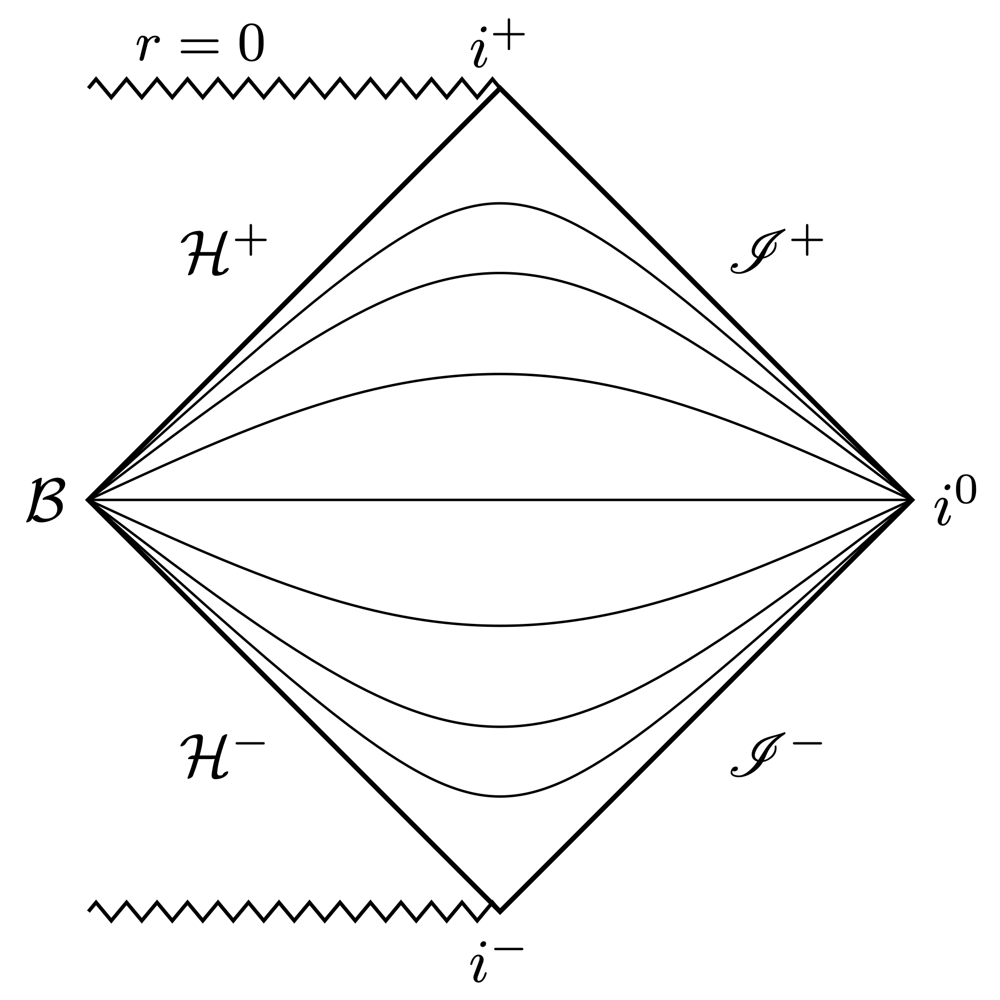
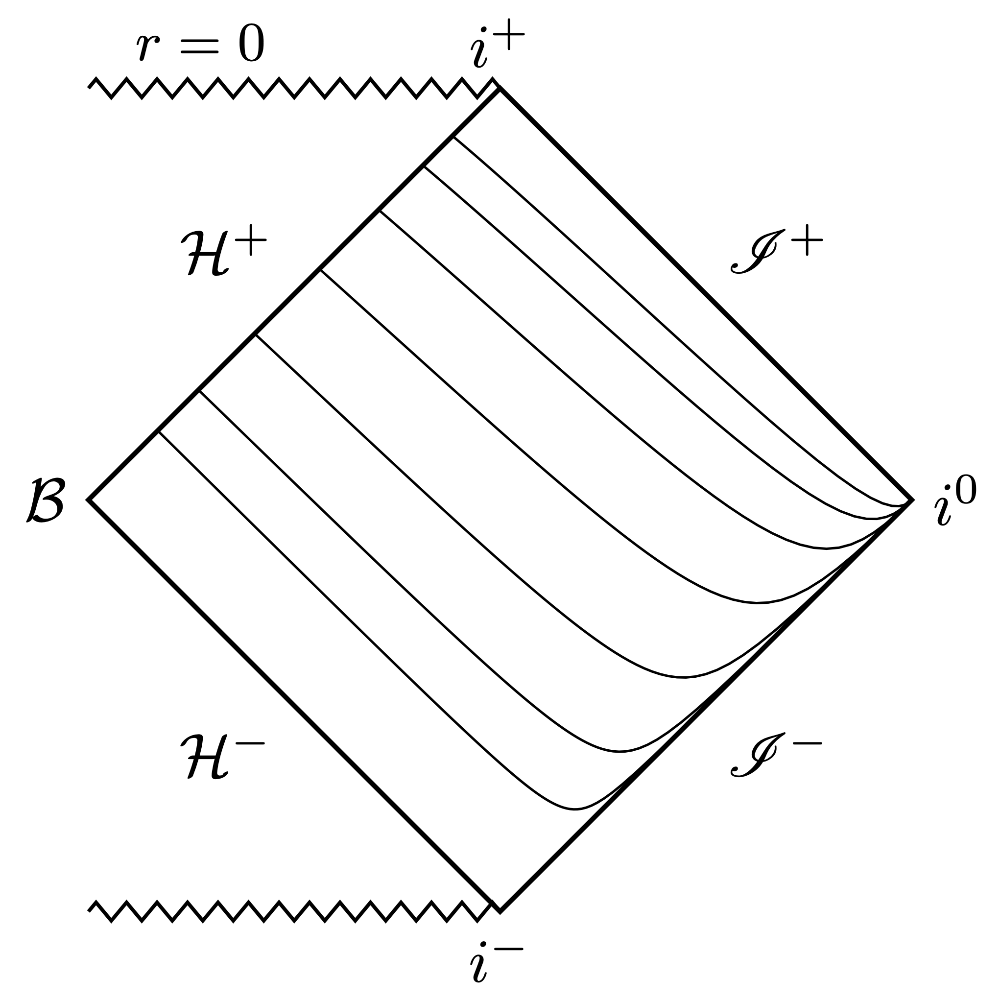
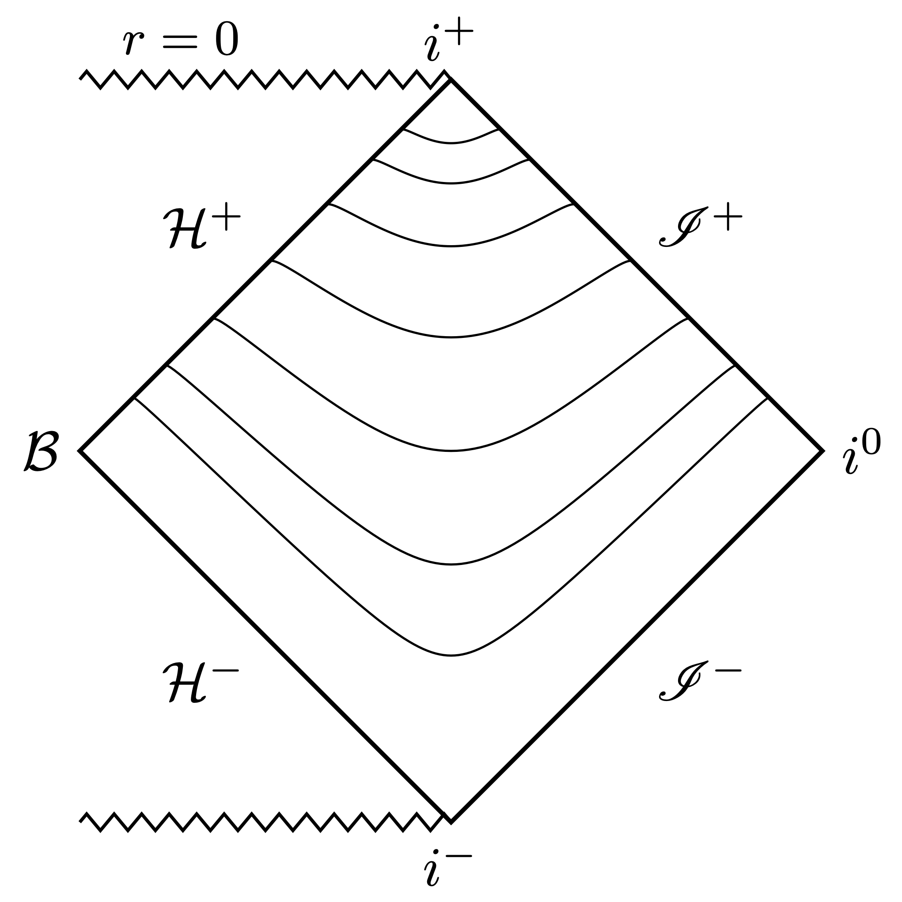
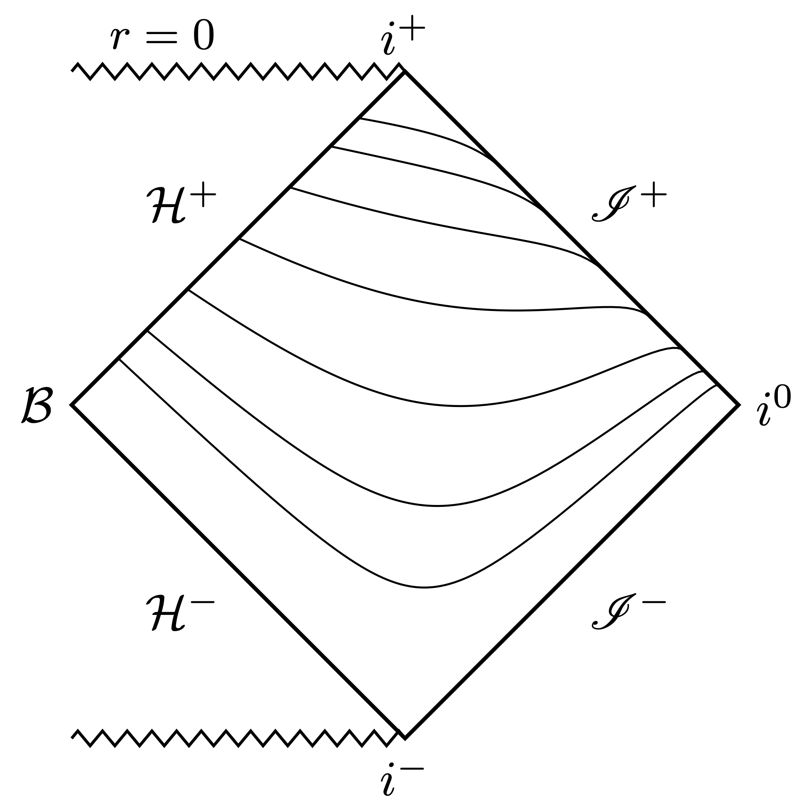

The [Penrose diagram](https://en.wikipedia.org/wiki/Penrose_diagram) is a valuable tool in relativity to illustrate the global causal structure of spacetimes[^1]. Often, qualitative diagrams are sufficient if you're mainly interested in the essential causal relationships. But sometimes, for numerical work or for your own understanding, you need a quantitatively correct diagram.

Below, we draw Penrose diagrams using free and open-source software. We'll draw the diagrams using the LaTeX package [TikZ](https://en.wikipedia.org/wiki/PGF/TikZ) (not a drawing program but a program that draws[^2]). We'll use Python to perform transformations when we hit the computational limitations of TikZ.


The code for all diagrams below is on my [website repository](https://github.com/anilzen/anilzen.github.io/tree/main/content/post/2022/drawing-penrose-diagrams/tikz).


### The basic idea behind Penrose diagrams

The Penrose diagram is an extension, or better, a *completion* of the [Minkowski diagram](https://en.wikipedia.org/wiki/Spacetime_diagram). Like in the Minkowski diagram, time is vertical, space is horizontal, and null rays are at 45 degrees to the axes. In contrast to the Minkowski diagram, a Penrose diagram includes "points at infinity" added by compactification, thereby visualizing the rich structure of infinity arising from the unification of space and time.


Below are two beautiful [TikZ diagrams](https://tikz.net/relativity_penrose_diagram/) by [Izaak Neutelings](https://www.physik.uzh.ch/en/researcharea/cms/people/Izaak-Neutelings.html). On the left is the Minkowski diagram. Spacetime extends infinitely in all directions. On the right is the  Penrose diagram representing the entire spacetime in a finite square. 

|    |    |
| :----: | :----: |
| ") | ") |

Compactification maps the Minkowski diagram to the Penrose diagram by mapping the null directions to a finite interval. Let's see how that works. 

### Minkowski spacetime
Consider the 4-dimensional Minkowski spacetime with standard spherical coordinates: $t \in (-\infty,\infty)$, $r \in [0,\infty)$, $\theta\in[0,\pi]$, $\varphi\in[0,2\pi)$ with metric
$$ ds^2 = -dt^2 + dr^2 + r^2 d\sigma^2, $$
where $d\sigma^2=d\theta^2+\sin^2\theta d\varphi^2$. Penrose diagrams are two-dimensional, so we essentially ignore the angular coordinates represented by the $d\sigma^2$ piece. Each point on the diagram, except the line at the origin, represents a sphere. Spherical light rays propagate along the directions $t+r$ and $t-r$. These directions are called [null](https://en.wikipedia.org/wiki/Null_vector) because they are in the [nullspace](https://en.wikipedia.org/wiki/Kernel_(linear_algebra)) of the metric.

Underlying the Penrose diagrams are coordinates, $T$ and $R$, which compactify these null directions:
$$ T+R = \frac{2}{\pi}\textcolor{DarkOrchid}{\arctan}(t+r),$$ 
$$ T-R = \frac{2}{\pi}\textcolor{DarkOrchid}{\arctan}(t-r). $$
The scale factor $2/\pi$ is to map the range of the coordinates to $T\pm R \in(-1,1)$. Note that I'm not including the endpoints in the intervals yet. The Penrose compactification procedure involves the conformal completion of the spacetime, which adds the points at infinity after a regularizing rescaling. This detail is not relevant for the diagrams but is important for geometry.

The Penrose coordinates $(T,R)$ read in terms of the standard $(t,r)$ as:
$$ T(t,r) = \frac{1}{\pi}\left( \arctan(t+r) + \arctan(t-r) \right)$$
$$ R(t,r) = \frac{1}{\pi}\left( \arctan(t+r) - \arctan(t-r) \right)$$

Let's make some plots using these coordinates. I'll demonstrate plotting time surfaces (level sets of a time coordinate). Say you'd like to draw constant $t$ surfaces in the Penrose diagram. You might be tempted to solve the above relationships for a graph function $T(R;t)$ with constant $t$. But it is easier to let the machine do the work and plot the surfaces parametrically. Define the functions $T(t,r)$ and $R(t,r)$ in TikZ as follows:
```latex
\tikzset{declare function={
    T(\t,\r)  = \fpeval{1/pi*(atan(\t+\r) + atan(\t-\r))};
    R(\t,\r)  = \fpeval{1/pi*(atan(\t+\r) - atan(\t-\r))};
}}
```
Then, plot the lines parametrically. 
```latex
\def\Nlines{6} % total number of lines is 2\Nlines+1
\newcommand\samp[1]{ tan(90*#1) } % for equidistant sampling 
\foreach \i [evaluate={\t=\i/(\Nlines+1);}] in {-\Nlines,...,\Nlines}{
    \message{Drawing i=\i...^^J}
    \draw[line width=0.3,samples=30,smooth,variable=\r,domain=0.001:1]
    plot({ R(\samp{\t},\samp{\r}) }, { T(\samp{\t},\samp{\r}) });
}
```
We're sampling points fairly evenly by incorporating the compactification into the plot function. As you can see in the diagrams below, the time surfaces are equally separated from each other at the origin. The function `samp` controls the separation of points in the plot.

|    |    |
| :----: | :----: |
| ](tikz/mink/mink_arctan.tex)") | ](tikz/mink/mink_tanh.tex)") |

The two versions of the diagram illustrate a coordinate-dependent feature that confuses even the experts. The $t$ surfaces intersect at spatial infinity, $i^0$, on both diagrams. On the left, they are tangent to each other, while on the right, they are not. So this seems to be a coordinate-dependent feature. Penrose used the inverse tangent function in his original papers. Many other choices exist. For example, using the hyperbolic tangent, the mapping reads
$$ T+R = \textcolor{DarkOrchid}{\tanh}(t+r),$$ 
$$ T-R = \textcolor{DarkOrchid}{\tanh}(t-r). $$
This mapping gives the diagram on the right where $t$ surfaces are not tangential at spatial infinity. There's a subtlety here. Conformal compactification with hyperbolic tangent is not regular when you include the angular dimensions. So be careful what you choose for the mapping.

I draw Penrose diagrams typically to present the causal structure of [hyperboloidal](https://hyperboloid.al) surfaces. Such surfaces behave like spacetime hyperboloids: they are spacelike everywhere, including null horizons. Spacetime hyperboloids are typically defined by the level sets of $\tau$ as
$$ t^2 - r^2 = \tau^2 \implies \tau = \pm \sqrt{t^2 - r^2}. $$
This construction appears in many models, such as the [Milne model](https://en.wikipedia.org/wiki/Milne_model) of cosmology, [Dirac's point-form](https://journals.aps.org/rmp/abstract/10.1103/RevModPhys.21.392) of relativistic dynamics, the [de Boer-Solodukhin](https://arxiv.org/abs/hep-th/0303006) holography of Minkowski spacetime, and the [Buchholz-Roberts framework](https://arxiv.org/abs/1304.2794) of relativistic QED. However, these surfaces are not generally useful for studying evolution in time because they intersect at future null infinity. This may not be immediately obvious from their definition, but you can see it right away on the Penrose diagram (left panel below). 

|    |    |
| :----: | :----: |
| ](./tikz/mink/mink_hypal_intersect.tex)") | ](tikz/mink/mink_hypal_foliation.tex)") |

A better option for a foliation of Minkowski spacetime, illustrated on the right panel above, is to use time-shifted hyperboloids. We pick one spacetime hyperboloid, say, with unit radius, and shift it in time by $\tau$, like this
$$ (t-\tau)^2 - r^2 = 1 \implies \tau = t \pm \sqrt{1+r^2}. $$
Choosing the minus sign gives a future hyperboloidal foliation. The surfaces do not intersect but provide a smooth foliation of future null infinity.

This example demonstrates how causal structures that may not be immediately clear from the formulas can be illustrated and understood with Penrose diagrams. Other examples include the counterintuitive causal structure of hyperboloidal surfaces or the intersection of standard time surfaces at spatial infinity. We can demonstrate such properties by calculations, but it's much easier to understand them with the help of a Penrose diagram.

#### Reading data into TikZ
TikZ is limited in its data processing capabilities. As a consequence, the evaluation of the lines in the plots takes a while. Once you move away from Minkowski spacetime, the transformations become too complicated for TikZ. To handle complicated mathematical transformations, you can generate the data for the plots in Python, write them in a file, and plot them with TikZ. Below is the Python code to generate the data files for each time surface.

```python
import numpy as np
t = np.linspace(-np.pi/2.,np.pi/2,14,endpoint=False)[1:]
r = np.linspace(0,np.pi/2,30)
def penrose_coords(r,t):
    R = 1./np.pi*(np.arctan(t+r)-np.arctan(t-r))
    T = 1./np.pi*(np.arctan(t+r)+np.arctan(t-r))
    return R,T
for i, t_val in enumerate(t):
    R,T = penrose_coords(np.tan(r),np.tan(t_val))
    np.savetxt('arctan_data'+str(i)+'.csv',np.stack((R,T)).T, delimiter=',', fmt='%f', header="R,T", comments="")
```

You'll need the [numpy](https://numpy.org/) library installed in your environment (use [local environments for Python!](https://xkcd.com/1987/)). The array `t` contains the constant values of the time surfaces, the array `r` includes the samples of the plot parameter. The domains stop at $\pi/2$ because we use the $\tan$ function to sample the points for a relatively even distribution. Then, for each value of `t`, we write the $R,T$ coordinates into a CSV file with headers and some formatting.

On the TikZ side, we read these points from the respective files and plot them. To plot data points, I use the library `pgfplots`. The nodes must be drawn with respect to the axis of the plot, which is achieved with the `axis cs:` directive. The relevant part of the code is below.

```latex
 \begin{axis}[axis lines=none, xmin=-.1,xmax=1.1,ymin=-1.2,ymax=1.2,width=0.5\textwidth,height=0.8\textwidth]

    \node[right] at (axis cs:0.6,1) {\small{$\arctan(\cdot)$}};
    \coordinate (O) at (axis cs:0,0) ; % center: origin (r,t) = (0,0)
    \coordinate (S) at ( axis cs:0,-1); % south: t=-infty, i-
    \coordinate (N) at ( axis cs:0, 1); % north: t=+infty, i+
    \coordinate (E) at ( axis cs:1, 0); % east:  r=+infty, i0
    \draw[thick] (N) -- (E) -- (S) -- cycle;

    \newcommand{\scri}{\mathscr{I}} % null infinity
    \node[right] at (E) {$i^0$};
    \node[above] at (N) {$i^+$};
    \node[below] at (S) {$i^-$};
    \node[above, rotate=90] at (O) {\small{$r=0$}};
    \node[above right] at (axis cs: 0.5,0.5) {$\scri^+$};
    \node[below right] at (axis cs: 0.5,-0.5) {$\scri^-$};
    
    \foreach \file in {{arctan_data0.csv},{arctan_data1.csv},{arctan_data2.csv},{arctan_data3.csv},
    			    {arctan_data4.csv},{arctan_data5.csv},{arctan_data6.csv}}
  	  {\addplot[domain={-1,1}] table [x=R, y=T, col sep=comma] {\file};}

\end{axis}
```
This is probably not the most elegant solution; you switch platforms to draw the plots. If you're up for it, you might prefer using a Python library such as [tikzplotlib](https://pypi.org/project/tikzplotlib/) to avoid going back and forth between Python and TikZ.

### Schwarzschild spacetime
The Schwarzschild line element in standard (Droste) coordinates reads
$$ ds^2 = - f(r) dt^2 + \frac{1}{f(r)} dr^2 + r^2 d\sigma^2, \tag{SS} \label{1}$$
where
$$ f(r) = 1-\frac{2 M}{r},$$
or in dimensionless coordinates
$$ f(r) = 1-\frac{1}{r}.$$
Dimensionless coordinates are similar to setting $M=1/2$.

The metric is singular where $f(r)$ vanishes, at $r=1$. This surface is the [event horizon](https://en.wikipedia.org/wiki/Event_horizon), but the metric singularity is a coordinate artifact. There are regular coordinates across the event horizon, such as the [Gullstrand–Painlevé](https://en.wikipedia.org/wiki/Gullstrand%E2%80%93Painlev%C3%A9_coordinates) or the [Eddington–Finkelstein](https://en.wikipedia.org/wiki/Eddington%E2%80%93Finkelstein_coordinates) coordinates. In fact, we must use such regular coordinates to draw Penrose diagrams.

Penrose diagrams for Schwarzschild spacetime are traditionally drawn using a compactification of [Kruskal coordinates](https://en.wikipedia.org/wiki/Kruskal%E2%80%93Szekeres_coordinates). Let's copy them from Wikipedia (for a derivation, see, for example, the Appendix of my [thesis](https://anilzen.github.io/publication/zenginoglu-2007-conformal/)):
$$ \tau = (r-1) e^r \sinh \tfrac{t}{2}, $$
$$ \rho = (r-1) e^r \cosh \tfrac{t}{2}. $$
The coordinates of the Penrose diagram are compactified along the null directions just as in the Minkowski case:
$$ T = \frac{1}{\pi}\left( \arctan(\tau+\rho) + \arctan(\tau-\rho) \right)$$
$$ R = \frac{1}{\pi}\left( \arctan(\tau+\rho) - \arctan(\tau-\rho) \right)$$
The transformations are more complicated, so we will use Python codes to generate the lines and plot them with TikZ. Here's the Python function to construct the compactified Kruskal coordinates.
```python
def kruskal_coords(r, t):
    rho = np.sqrt(r-1)*np.exp(r/2)*np.cosh(t/2)
    tau = np.sqrt(r-1)*np.exp(r/2)*np.sinh(t/2)
    R = 2./np.pi*(np.arctan(tau+rho)-np.arctan(tau-rho))
    T = 2./np.pi*(np.arctan(tau+rho)+np.arctan(tau-rho))
    return R, T
```
I construct Schwarzschild radial points from tortoise coordinates that are on Chebyshev nodes because I want higher density near the horizon and infinity. There are different, possibly more effective ways of achieving such a beneficial point distribution, but this method works well enough.
```python
t_vals = np.linspace(-3., 3, 7)
r_tort = np.tan(np.pi/2*np.cos(np.pi * np.arange(0, 30+1) / 30))[::-1][2:-1]
r_schw = np.real(lambertw(np.exp(r_tort-1))+1)

for i, t_val in enumerate(t_vals):
    R, T = kruskal_coords(r_schw, t_val)
    fn = 'data/ss'+str(i)+'.csv'
    np.savetxt(fn, np.stack((R, T)).T,
               delimiter=',', fmt='%f', header="R,T", comments="")
    print('{'+fn+'},')
```
The Schwarzschild time slices intersect at the bifurcation sphere, $\mathcal{B}$, and at spatial infinity $i^0$. When you're interested in the behavior of fields near the black hole and far away from it (say, to study gravitational waves), it's [better](https://anilzen.github.io/publication/zenginoglu-2011-geometric/) to use non-intersecting time slices.

Most useful time functions are related to the Schwarzschild time by a "height" shift that depends only on the radial coordinate:
$$ t \to t + h(r). $$
For example, the height function for [Gullstrand–Painlevé](https://en.wikipedia.org/wiki/Gullstrand%E2%80%93Painlev%C3%A9_coordinates) coordinates is
$$ h_{\rm GP} (r) = -2 \sqrt{r} + \ln\frac{\sqrt{r}+1}{\sqrt{r}-1}. $$
Note that the height function is singular at the horizon. This singularity is needed to counteract the singularity of Schwarzschild time slices near the bifurcation sphere. Gullstrand–Painlevé gives a nice foliation of the future event horizon, $\mathcal{H}^+$, but the time slices still intersect at spatial infinity. 

|    |    |
| :----: | :----: |
|  |  |

We need a height function that's singular both near and far from the black hole. This idea underlies the construction of hyperboloidal coordinates. For example, 
$$ h_{\rm Hyp} (r) = \sqrt{1+ r_\ast^2}, $$
gives the hyperboloidal foliation on the left panel below. The slices do not intersect. Instead, you get a nice, smooth foliation of the full exterior domain. Another example with this nice behavior is the minimal gauge of [Ansorg, Jaramillo, and Macedo](https://arxiv.org/abs/1809.02837)
$$ h_{\rm MG} (r) = r + 2 \ln r - \ln(r - 1). $$

|    |    |
| :----: | :----: |
|  |  |

Similar constructions can also be made for Kerr, Reissner–Nordström, or Schwarzschild-de Sitter metrics. 


That's it! I hope this helps for the handful of people out there who draw Penrose diagrams. If you have any questions about the diagrams or the source files, email me at anil@umd.edu. I plan to write two more posts on Penrose compactification that should be of broader interest. Stay tuned!


<!-- These coordinates are good for plotting the maximally extended Schwarzschild solution but they are too complicated if you're primarily interested in the exterior region. You can draw a Penrose diagram for Schwarzschild just like in the Minkowski case by using the tortoise coordinate. The reason is that the $t,r$ portion of the Schwarzschild metric is conformally flat in the tortoise coordinate. Since Penrose diagrams are conformal diagrams, all the usual tricks apply. -->


<!-- The Schwarzschild case reduces to the Minkowski case when we switch to the tortoise coordinate (up to a constant)
$$ r_\ast = \int \frac{dr}{f(r)} = r + 2 M \log \left(\frac{r}{2M}-1\right).$$
The Schwarzschild metric \eqref{1} becomes
$$ ds^2 = f(r(r_\ast)) (- dt^2 + dr_\ast^2) + r(r_\ast)^2 d\sigma^2. $$
Ignoring the angular part, the spacetime metric is just a conformal Minkowski metric in coordinates $(t,r_\ast)$ with in- and outgoing coordinates $t+r_\ast$ and $t-r_\ast$. For a Penrose diagram, you can consider the Schwarzschild metric to be simply $ -dt^2 + dr_\ast^2$. The main difference is the domain of $r_\ast$. While the domain of $r$ in Minkowski is $[0,\infty)$, the domain of the tortoise coordinate $r_\ast$ in Schwarzschild is $(-\infty, \infty)$. This difference is why the Minkowski conformal diagram is a triangle, whereas the conformal diagram for the exterior Schwarzschild spacetime is a diamond.  -->


[^1]: For a rigorous, mathematical definition of Penrose diagrams, see the Appendix C.2 in a [paper](https://arxiv.org/abs/gr-qc/0309115) by Dafermos and Rodnianski.
[^2]: The curious capitalization of TikZ derives from the capitalization of the German expression "TikZ is kein Zeichenprogramm."


<script src="https://giscus.app/client.js"
        data-repo="anilzen/anilzen.github.io"
        data-repo-id="MDEwOlJlcG9zaXRvcnkzNzExMzY1Njk="
        data-category="General"
        data-category-id="DIC_kwDOFh8YOc4CTAsV"
        data-mapping="pathname"
        data-strict="0"
        data-reactions-enabled="1"
        data-emit-metadata="1"
        data-input-position="top"
        data-theme="dark"
        data-lang="en"
        data-loading="lazy"
        crossorigin="anonymous"
        async>
</script>