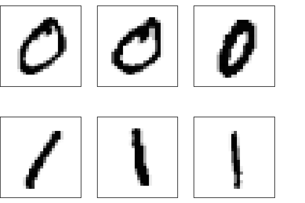

<a target="_blank" href="https://colab.research.google.com/drive/1A80Z_o55cJI-PkHjsg-j2sUiwsx3A9EY?usp=sharing">
  
</a>

## Neural Network: What is machine learning?
The core of a machine learning algorithm is the neural network that maps inputs to desired outputs. The term "neural network" calls to mind structures in the human brain with layers of interconnected neurons working together to solve problems. But in machine learning, we are simply talking about a function with parameters. "Learning" is adjusting these parameters until the difference between the desired output and the actual output of the function is sufficiently small. That's it.

This was a very short summary of what people mean by machine learning. You can imagine that the function, the parameters, and the adjustment process are all rather sophisticated and can get very complicated. I'll expand on this basic idea below with an example of a machine-learning algorithm. 

First, some terminology. Think of each input dimension as a neuron in a neural network. The parameters of the neural network, or the function, are called weights and biases. Weights represent the strength of the connection between neurons; biases shift the activation threshold of a neuron. By adjusting the weights and biases based on the output, the network learns the patterns in the data and makes predictions on new data.

Let's write this down. I mentioned that the neural network is just a function with parameters. Its output is usually a probability, so we'll call it $p$. The network should look something like $p=f(x; W,b)$, where $x$ is the input array, $p$ is the network's output array, $W$ are the weights, and $b$ are the biases. A simple neural network could then be written like this
$$  p = W \cdot x + b. $$
But wait, you say; this is just a linear transformation! Layering linear transformations on top of each other only create a linear network. You can't learn complex patterns and make accurate predictions with just linear transformations. To introduce nonlinearity into the model, we throw this into a nonlinear activation function $\sigma$, so the output looks like
$$  p = \sigma(W \cdot x + b). \label{1} \tag{1} $$ 
There are a few commonly used activation functions that one frequently encounters: the sigmoid function, the hyperbolic tangent (tanh) function, the rectified linear unit (ReLU) function, and so on. We'll use a generalization of the sigmoid (or logistic) function for our experiments. 
$$ \sigma(x) = \frac{1}{1 + e^{-x}} $$
This function maps a real-valued input to a value between 0 and 1, so the output can be interpreted as a probability, making it directly useful in classification problems.

To get into more detail, we need to understand and prepare the input. I use the MNIST dataset for the demonstration below. We will avoid the powerful machine learning packages and only use NumPy[^1], so all operations can be considered elemental. You can follow along on [Colab](https://colab.research.google.com/drive/1A80Z_o55cJI-PkHjsg-j2sUiwsx3A9EY?usp=sharing).
<a target="_blank" href="https://colab.research.google.com/drive/1A80Z_o55cJI-PkHjsg-j2sUiwsx3A9EY?usp=sharing">
  
</a>

## MNIST Dataset: Prepare the input
The MNIST dataset is a large database of handwritten digits consisting of 60,000 training images and 10,000 test images. Each image is a 28x28 grayscale image labeled with the correct digit, from 0 to 9. It's commonly used for training and testing various image processing and machine learning algorithms. The digits in grayscale look like this


Our goal is to teach the single-layer network (\ref{1}) to recognize these handwritten digits. The network learns from the training dataset by adjusting its weights to minimize the difference between the desired output and the actual output, that is, the loss. This process is repeated until the loss is sufficiently small, implying that the network has learned the dataset. So we need to define the loss, calculate how it depends on layer parameters, and find a way to minimize it iteratively.

## Layer and Loss: Build the model
Our model architecture consists of just the one layer in (\ref{1}). So this is an example of shallow learning. But even with shallow networks, it can get confusing with the number of samples, inputs, and outputs. To recap, we have $M=60,000$ samples in the training set; each sample has $N=28\times28=784$ dimensions (one for each pixel in a flattened 1D-array); the output has $K=$10 dimensions (one for each digit). Accounting is worse when you have hidden layers in between. They all live in different spaces, so it makes sense to introduce different types of letters into the tensor notation for each type of space. To clarify each space, I like to define indices with their own ranges[^2]: 
$$ \begin{align} 
a,b&=1,2,\dots,M=60,000. \\\
\alpha, \beta&=1,2,\dots,N=784. \\\\
i,j&=1,2,\dots,K=10.
\end{align}  $$
We can then write the output of our AI algorithm as
$$   p_{ai} = \sigma(z_{ai}) = \sigma\left( \sum_{\alpha=1}^{N} x_{a\alpha} W_{\alpha i}  + b_i \right). \tag{2} \label{2}  $$
Here, $\sigma$ is a generalization of the sigmoid function, called the softmax function. In code, we write
```python
def p_ai(x, W, b):
    z = np.dot(x,W) + b
    return softmax(z)
```
This step is sometimes called the forward pass.

We do not use the sigmoid function because we have to ensure that the output probabilities sum to one. The softmax function is defined as
$$\sigma(z_i) = \frac{e^{z_i}}{\sum_{j=1}^{K} e^{z_j}}. \tag{3} \label{3} $$ 
It maps a vector of arbitrary real values, $z_i$, to a vector of values between 0 and 1. The sum of all outputs is 1, so each output can be interpreted as a probability. This makes it a useful activation function for multiclass classification tasks, where the predicted probabilities must sum to 1.

The softmax function is numerically unstable if implemented naively, so we rewrite it such that the maximum value of the input array is 0.
```python
def softmax(z):
    z = z - np.max(z, axis = 1)[:,np.newaxis]
    return np.exp(z) / np.sum(np.exp(z), axis = 1)[:,np.newaxis]
```
<hr />

We now need to devise a way to tell our network when its outputs, $p_{ai}$, are losers. This is done by defining a loss function that measures the difference between the desired output, $y$, and the actual output, $p$. There are many possible choices. For example, when predicting a continuous variable, one typically uses a regression loss function such as mean squared error or mean absolute error. We have a multiclass classification problem (one class for each digit), so we'll use the cross-entropy loss[^3] defined as
$$ L = - \frac{1}{M} \sum_{a=1}^M \sum_{i=1}^N y_{ai} \log p_{ai}, \tag{4} \label{4} $$
where $p$ is the predicted probability, $y$ is the actual probability, $M$ is the number of samples, and $N$ is the number of classes. In NumPy
```python
def cross_entropy(y, p):
    return -np.mean(y*np.log(p))
```
The cross-entropy loss is often used with a softmax activation function in the output layer of a classification model. One of the main reasons is the beautiful simplification of its derivative with respect to the input. But I'm getting ahead of myself here.

How do we minimize the loss? We can evaluate the function at different locations in the parameter space to search for the minimum, but that's not an efficient approach, especially in high dimensions. In our simple toy example, the parameter space of weights and biases has $784\times 10+10=7,850$ dimensions. 

A better approach is gradient descent. We start at some random point which will invariably have a large loss. It's like starting on a big hill. To go to the bottom, you take small steps downhill, that is, you descend along the negative gradient, until you can't go reasonably further. We need to compute the gradient of the loss function with respect to the weights and biases to determine the downhill direction. Using the chain rule, we obtain the following formula for the derivative of the loss function with respect to bias
$$  \frac{\partial{L}}{\partial b_{j}} = - \frac{1}{M}\sum_{a=1}^M \sum_{i=1}^N \sum_{k=1}^N y_{ai}\frac{\partial \log p_{ai}}{\partial z_{ak}}  \frac{\partial z_{ak}}{\partial b_j} . $$
This calculation is where the simplification comes in when you combine the cross-entropy loss with softmax activation. To demonstrate, write the total loss as the mean of the losses of all samples, $L=\tfrac{1}{M}\sum_{a=1}^M \ell_a$. Let's compute the derivative for a single sample, suppressing its index
$$  \frac{\partial{\ell_a}}{\partial b_{j}} = - \sum_{i=1}^N \sum_{k=1}^N  y_{i}\frac{\partial \log p_{i}}{\partial z_{k}}  \frac{\partial z_{k}}{\partial b_j} . $$
The log-term[^4] with the definition of softmax (\ref{3}) reads
$$ \log p_i = \log (\sigma(z_i)) = z_i - \log\left(\sum_{j=1}^K e^{z_j}\right).$$
We get for the $z$-derivative
$$ \frac{\partial \log p_i}{\partial z_k} =  \delta_{ik} - \frac{e^{z_k}}{\sum_{j=1}^K e^{z_j}} = \delta_{ik} - p_k.$$
Combining with the summation over $y$, we obtain this very simple formula
$$ \sum_{i=1}^{N} y_{i} (\delta_{ik} - p_k) = y_k -  p_k \sum_{i=1}^{N} y_{i} = y_k -  p_k. $$
For the last step, remember that $y_i$ are probabilities that sum up to 1. We then have
$$  \frac{\partial{\ell_a}}{\partial b_{j}} = \sum_{k=1}^N (p_k - y_k)\frac{\partial z_{k}}{\partial b_j} $$
Now we can insert the dependence of $z$ on $b$ and bring back the summation over the samples with index $a$ to get
$$  \frac{\partial{L}}{\partial b_{j}} = \frac{1}{M} \sum_{a=1}^M (p_{aj}-y_{aj}). $$
Similarly, for the weights
$$  \frac{\partial{L}}{\partial W_{\beta j}} = \frac{1}{M} \sum_{a=1}^M (p_{aj}-y_{aj}) x_{a\beta}. $$
In NumPy, the gradient of the loss is then calculated by[^5]
```python
def gradient(x, y, p):
    dL = (1/len(x))*(p-y)
    db = np.sum(dL,axis = 0)
    dW = np.dot(dL.T,x).T
    return dW, db
```
We then update the weights and biases based on these gradients with some step size $\lambda$. What mathematicians call step size is called learning rate in machine learning, even though it's not quite a rate. Anyway, we update the weights and biases iteratively as follows
$$ \begin{align} 
W^{n+1} &=  W^n - \lambda \frac{\partial{L}}{\partial W}, \\\\
b^{n+1} &=   b^n - \lambda \frac{\partial{L}}{\partial b}.
\end{align} $$

## Train and Evaluate
We now have everything in place to train the network using the training set. To recap, we initialize the weights and biases randomly and then run multiple epochs[^6], during which we get the network output (forward pass), compute the gradient of the associated loss, and update the weights and biases in the direction of the negative gradient with a constant learning rate (backpropagation). Below is all of this in code.
```python
input_dim, output_dim = 784, 10
epochs = 200
lr = 6

W, b = init(input_dim, output_dim)
for epoch in range(epochs):
    p = p_ai(X_train, W, b)
    dW, db = gradient(X_train, y_train, p)
    W, b = update(W, b, dW, db, lr)
```

To evaluate the accuracy of the network on the training set, we compare the network's prediction with the labels 
```python
accuracy=[]; entropy_loss=[]
...
    accuracy.append(100*np.count_nonzero(np.argmax(p,axis=1) == np.argmax(y_train,axis=1)) / len(X_train))
    entropy_loss.append(cross_entropy(y_train,p))
```
We get about \%90 accuracy with this simple method on both the test and the training sets!


## Wrapping up

The building block of a neural network is the single layer (\ref{1}). I hope you obtained an understanding of how a neural network layer is trained and what people mean when they say the machine has learned something. My goal was to provide a basic understanding of this procedure. This can get very complicated. Large operational machine learning models, such as [GPT-3](https://en.wikipedia.org/wiki/GPT-3), [Gopher](https://www.deepmind.com/blog/language-modelling-at-scale-gopher-ethical-considerations-and-retrieval), or [Megatron-Turing NLG](https://developer.nvidia.com/megatron-turing-natural-language-generation) use many network layers with hundreds of billions of parameters, but the procedure is similar. 

You now have a few simple tools as a starting point for further inquiry. Here are a couple of directions to go from here:

- Use a more complex neural network with at least one hidden layer. The "deep" in deep learning comes from hidden layers. Each layer dramatically increases the parameter space's dimension, which also increases computation time. But the gain in accuracy may be worth it. You can easily get about \%97 accuracy with just one additional layer for the MNIST dataset.
- Batch-process your samples. Batch processing was not necessary for his example, but with higher dimensions and larger training sets, it becomes necessary. There are also indications that batch-processed (stochastic) gradient descent generalizes better.
- Use a better optimization procedure. The step size, $\lambda$, or `lr`, is the most important parameter in gradient descent. I chose the rather large value of `lr=6`. You can see in the plots that the loss doesn't decrease monotonously. A simple fix for this is to multiply the learning rate with a scalar slightly less than 1, so it gets smaller at every epoch. But more importantly, you should use a better optimizer such as Adams. In fact, my interest in optimization is the reason I wrote this post. With Jingcheng Lu and Eitan Tadmor from the University of Maryland, we constructed a [swarm-based gradient descent](/content/publication/2022-swarm-based-gradient-descent/) that avoids getting trapped at local minima. The method beats existing optimizers in certain types of non-convex optimization problems. I'm experimenting to see whether it's useful in machine learning applications.


[^1]: NumPy is a free, open-source Python library for scientific computing and data analysis. It has a lot of functionality, but the main reason for using NumPy here is its speed. It uses vectorization instead of looping through individual elements to perform calculations on an array, allowing faster calculations and more efficient use of memory. NumPy operations are implemented in C using highly optimized libraries that take advantage of modern processor architectures, so we are not slowed down by Python's excruciatingly inefficient loops.

[^2]: This is common practice in theoretical physics, in particular, in general relativity, where we have maps between and projections onto various different spaces and subspaces. The tensor notation using different types of letters helps keep track of the spaces in the computations. I was tempted to introduce the Einstein summation convention here as well, but it doesn't quite work.

[^3]: You might recognize this expression of entropy. It appears commonly as $-\sum p_i \log p_i$ in different entropy formulas such as Gibbs entropy, Shannon entropy, and von Neumann entropy. In our case, it's a way of measuring the difference between two probability distributions. We compare the true distribution of the labeled data, $y$, and the predicted probability distribution from the model, $p$. When the same probability distribution $p$ is used on either side of the log function, for example, in Shannon entropy, it measures the amount of uncertainty or randomness in that given probability distribution, which is useful for encoding information or measuring the level of disorder in a system. The purpose and interpretation are different in those cases, but the underlying similarity is the quantification of disorder, which justifies using the term entropy.

[^4]: It seems that in machine learning, NumPy, and many other mathematical software programs, $\log$ refers to the natural logarithm with base $e$, which I adopted for this post. It is confusing because, in information theory, $\log$ commonly refers to base 2. But of course [everybody knows that](https://en.wikipedia.org/wiki/Logarithm#Particular_bases) $\log$ is base 10, and for the other stuff, you either write $\ln$ for base $e$ or $\log_2$ for base 2. In short, use your $\log$ with caution.

[^5]: You might think that the double transpose in `np.dot(dL.T,x).T` is unnecessary. Why not write it as `np.dot(x.T, dL)`? It turns out that the former dot product is faster because of the way the data is stored in memory. 

[^6]: These are actually iterations. The term epochs alludes to a bright future where you might want to process your training data in batches. Batch processing is among the many directions you might want to expand the code.