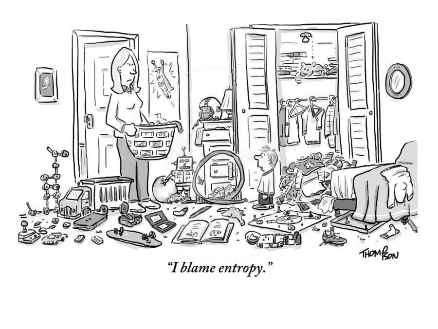

We're all gonna die. 

Blame the Second Law of Thermodynamics. Entropy increases, we get older, and we die.

This perception of entropy, prevalent in popular culture, presents it as the driving force for decay and disorder. But this cannot be the whole story. The incredible abundance of life on our planet would not have been possible without the self-organization of complex systems. The story of [entropy and life](https://en.wikipedia.org/wiki/Entropy_and_life) is more complicated than the boy in the above cartoon implies. To understand these larger questions about Life, the Universe, and Everything, we need to first clarify what entropy is.

This post is about a variant of entropy---called cross-entropy---that I wrote about in a post on [machine learning](../../2022/learning-machine-learning/). There, I presented cross-entropy as a measure of [the difference between two probability distributions](http://localhost:1313/post/2022/learning-machine-learning/#fn:3). Most explanations of the concept, including its [Wikipedia entry](https://en.wikipedia.org/wiki/Cross_entropy), mainly focus on its relevance in information theory, not physics. 

I recently learned in a [talk](https://www.youtube.com/watch?v=x9COqqqsFtc) by [Sean Carroll](https://www.preposterousuniverse.com/) that cross-entropy plays a central role in the informational reformulation of the Second Law. This way of thinking about entropy and the Second Law builds a fascinating bridge between machine learning and physics. Before we cross that bridge, let's talk about plain old entropy.

## Entropy Without a Cross

Entropy is one of the most important concepts in physics. It's the main character of the Second Law of Thermodynamics, which states that the entropy of an isolated system increases over time. 

Despite its importance, entropy is not as widely known or used as energy. Whether you're trying to count your calories, arguing about the geopolitics of natural gas, or worrying about climate change, energy seems to be the main character. But it doesn't quite make sense. We know that energy is conserved; all we do is transform energy from one form to another. Yet we sense that something is irreversibly lost when we "spend energy." What exactly are we spending when we burn food or natural gas? Check out the next paragraph. The answer will [surprise](#surpriiise) you!

Well, it's entropy. And its story starts with heat.
### The Birth of Heat
Thermodynamics is the study of heat, energy, and work. It was born in the 19th century during the Industrial Revolution from the desire to understand how to efficiently convert heat energy into mechanical work. 

[Sadi Carnot](https://en.wikipedia.org/wiki/Nicolas_L%C3%A9onard_Sadi_Carnot) showed that the efficiency of a heat engine depends only on the temperature difference between the hot and cold reservoirs and not on the specific working substance or the details of the engine design.[^0] While this observation had huge practical implications, his main contribution for our purposes is the distinction between reversible and irreversible processes, which led to the notion of entropy.

The [term entropy](https://en.wikipedia.org/wiki/Entropy#Etymology) was coined by the German physicist [Rudolf Clausius](https://en.wikipedia.org/wiki/Rudolf_Clausius) in 1865 as a counterpart to the term energy. The 19th-century German intellectuals were enamored with [neoclassical hellenism](https://en.wikipedia.org/wiki/Hellenism_(neoclassicism)), which resulted in lots of Greek words in scientific literature. _Entropia_ means "transformation to" in Greek. So the German word "Entropie" is the germanized Greek translation of the German word "Verwandlungsinhalt," which Clausius used to describe the transformational content of energy. 

When you burn natural gas to generate heat, you spend the transformational content of the natural gas. The heat that results in this process cannot be transformed back; entropy increases. Clausius formulated the observation that heat flows naturally from a hot body to a cooler one through the inequality
$$ dS ≥ \frac{\delta Q}{T}. $$
Clausius used $S$ for entropy in honor of Sadi Carnot, so $dS$ denotes a small change in entropy, $\delta Q$ is the heat the system absorbs from its surroundings, and $T$ is the temperature at which the heat is absorbed. In an adiabatic process without heat exchange, we have $\delta Q=0$, and entropy can never decrease in accordance with the Second Law.

Entropy encapsulates the irreversible processes that we typically associate with energy usage. Concepts like [energy crisis](https://en.wikipedia.org/wiki/Energy_crisis) actually refer to entropy crisis: we need a continuous supply of low entropy to keep the world running.

Clausius' inequality doesn't give an origin story or an explanation for entropy. For that, we need statistical physics.

### Atoms

The famous equality that describes entropy is engraved in Boltzmann's [tombstone](https://en.wikipedia.org/wiki/Boltzmann%27s_entropy_formula#/media/File:Boltzmann_equation.JPG)[^8]
$$ S = k \log W. \tag{1} \label{1} $$
In this expression, $k$ is the Boltzmann constant, $W$ is the number of microstates corresponding to a particular macrostate of the system. To understand what $W$ represents, think of a system composed of many parts, say, tiny atoms. Our description of the system uses a few variables, such as heat and pressure. This macroscopic description is clearly underdetermined: there are gazillions of atomic configurations that result in a given value for heat and pressure. A macrostate is a collection of $W$ individual microstates that are macroscopically indistinguishable. It's the number of equivalent ways the subsystems (atoms) can be arranged without changing the macroscopic state.

The logarithm in the formula arises from known observations about entropy and simple combinatorics. Consider two systems. It was known that their total entropy is the _sum_ of their entropies, $S=S_1+S_2$, but the total number of microstates for the full system is the _product_ of its parts, $W=W_1*W_2$. The only function that converts a product into a sum is the $\log$ which tells us that $S\sim \log W$. The Boltzmann constant in \eqref{1} makes the units work.

The Second Law is then a probabilistic statement: among different macrostates, the system evolves towards a more probable configuration, one with a larger number of microstates. In this picture, we don't expect entropy to _always_ increase. It just happens to be more probable. You will run into fluctuations where entropy goes down if you wait enough.[^5] 
A rather outrageous extrapolation of this idea is the [Boltzmann brain](https://en.wikipedia.org/wiki/Boltzmann_brain): a self-aware brain that spontaneously appears in a universe through random fluctuations rather than through biological evolution.[^2]
 
 generated with [Midjourney](https://www.midjourney.com).")

### Surpriiise!

With the rise of calculators, computers, and communication devices in the 20th century, information started to play a fundamental role in our description of physical phenomena.[^wh]
[Shannon's](https://en.wikipedia.org/wiki/Claude_Shannon) reformulation of entropy in [The Mathematical Theory of Communication](https://ieeexplore.ieee.org/abstract/document/6773024) relates information to surprise.

What is surprise? To be surprised, you must have a prior expectation, some sense that things happen in a certain way. The more you expect something, the less surprised you are to see it, and vice versa. Therefore, surprise $s$ should be a decreasing function of probability $p\in [0,1]$. Specifically, we're looking for an expression $s(p)$ that satisfies the following reasonable conditions:

- If you're absolutely certain of $x$, then $p(x)=1$ and you're not surprised: $s(1)=0$.
- If you're absolutely certain that $x$ can never happen, then $p(x)=0$ and its occurence surprises you infinitely: $s(0) \to \infty$.[^3]
- Surprise should be additive: the total surprise for multiple events should be the addition of the surprise associated with each event. For two events $x_1$ and $x_2$, the combined probability is $p=p_1 * p_2$ and the total surprise should be $s(p) = s(p_1*p_2) = s(p_1) + s(p_2)$

These conditions are satisfied by a formula that depends logarithmically on the inverse of $p$:
$$ s(p) = \log \frac{1}{p} = - \log p. $$ 

Entropy is then the probability-weighted sum of surprise. In other words, entropy is expected surprise:

$$ S = \sum p_i\ s(p_i) = - \sum p_i \log p_i.  \label{2} \tag{2}$$

Boltzmann used a similar formula [already in 1866](https://en.wikipedia.org/wiki/Boltzmann%27s_entropy_formula#Generalization), yet the expression is named after Gibbs and Shannon. It reduces to Boltzmann's first formula \eqref{1} when the probabilities of all microstates are equal, which can then be used to derive Clausius' inequality.[^4]

An increase in entropy means that the expected surprise increases. This might sound a bit counterintuitive. We learned that entropy is a measure of disorder. How are disorder and surprise related?

It may be simpler to understand that patterns reduce _total_ expected surprise. Let's say every time I order a taxi, I get a yellow cab. Over time, the total expected surprise about the color of the taxi cab will be low even though I might get a blue cab once in a blue moon. If, however, the color of the taxi cab is different every single time, those little surprises add up and maximize the total expected surprise. Disorder increases total expected surprise over a collection of events. It's highest when the events are random.

## The Cross of Entropy
Boltzmann's entropy \eqref{1} generalizes to Gibbs-Shannon entropy \eqref{2}, allowing different probabilities for the microstates. The next generalization[^renyi] includes a distinction between the expected and observed probabilities and is commonly used to define loss functions in supervised machine learning.

### Learning to Expect the Unexpected
In Gibbs-Shannon entropy \eqref{2}, the weights of the sum, $p_i$, are from the same probability distribution that quantifies surprise, $s(p_i)$. But those two distributions are not necessarily the same. Our surprise arises from our assumed expectations, let's call it $q_i$, which may need to be corrected or updated. A good example is climate change, when 100-year storms start happening every decade. The probability distribution for heavy storms has shifted, so we need to adjust our expectations. 

We may formally use the true distribution, $p_i$, for the weights, which are unknown a priori and must be learned from observations. The cross-entropy, $H$, accounts for the difference between true and assumed expectations.
$$ H(p,q) = - \sum p_i \log q_i. $$
The cross-entropy $H$ is the true expected value of our assumed surprise. In other words, it's the expected value, with respect to the true distribution $p$, of our surprise, with respect to the assumed distribution $q$. It measures how likely we are to be surprised (and therefore learn something) if we were told the actual probability distribution of the system.[^6] It obtains a minimum when the two distributions are equal. 

This property is why it's so useful in machine learning where cross-entropy is used to construct the [loss function](../../2022/learning-machine-learning/#layer-and-loss-build-the-model) in multiclass classification tasks. The true labels of the training samples serve as the true distribution; the output labels of the neural network serve as the assumed distribution. The cross-entropy loss function is iteratively reduced by numerical optimization. Eventually, the true distribution of the labels matches the predicted distribution from the neural network sufficiently well. At that point, we say the machine learned the training set.

### The Second Coming of the Second Law
The Second Law of Thermodynamics has been reformulated using cross-entropy by Bartolotta, Carroll, Leichenauer, and Pollack to "incorporate the effects of a measurement of a system at some point in its evolution." [The Bayesian Second Law of Thermodynamics](https://arxiv.org/abs/1508.02421) uses an information-theoretic approach. Sean Carroll has a great [blog post](https://www.preposterousuniverse.com/blog/2015/08/11/the-bayesian-second-law-of-thermodynamics/) about this paper; you should read it. Here's a short description in our context. 

According to the Bayesian Second Law, the cross-entropy of the updated ("true") distribution with respect to the original ("assumed") distribution, plus the generalized heat flow, is larger when evaluated at the end of the experiment than at the beginning. For zero heat transfer, the expected amount of information an observer would learn by being told the true microstate of the system is larger at the final time than at the initial one. Therefore, cross-entropy can change over time according to how well our initial assumptions about a system match its true underlying distribution and how much new information we gain through measurements and updates to our assumptions.

This updated Second Law describes the increase in cross-entropy as
$$ \Delta H(p, q) + \langle Q \rangle \geq 0, $$
where $\langle Q \rangle$ is the expectation value of a generalized heat flow out of the system, similar to the term $\delta Q$ in Clausius' inequality (with a different sign).

When the assumed distribution differs significantly from the correct distribution during time evolution, it can lead to information loss and, therefore, a large increase in cross-entropy. Cross-entropy increases with time even with zero heat transfer. In this interpretation, what happens during optimization in a machine learning model (decreasing cross-entropy) is the opposite of what happens in stochastic evolution (increasing cross-entropy): The act of learning is a revolt against disorder and decay!

## The Death of Heat

At the beginning of the post, I mentioned that the relationship between life and entropy is complicated. When it comes to the Universe, however, things are much simpler. The Universe is evolving towards [heat death](https://en.wikipedia.org/wiki/Heat_death_of_the_universe). 

As the Universe continues to expand and matter becomes more dispersed, it will become increasingly difficult for matter to interact with other matter, and energy will become more evenly distributed. Eventually, all stars will have exhausted their fuel, and the Universe will be a cold, dark, lifeless place where nothing happens.

One of my favorite science-fiction short stories is Asimov's [The Last Question](http://users.ece.cmu.edu/~gamvrosi/thelastq.html). It's a story about the heat death of the Universe with the perfect punch line. The story begins with two technicians attending to a giant, self-adjusting, and self-correcting computer, called Multivac that found a way to fulfill the Earth's energy needs by drawing energy from the Sun. The technicians argue that the Sun and all the stars in the Universe will eventually run out. They ask Multivac whether entropy can be reversed, to which Multivac replies, "INSUFFICIENT DATA FOR MEANINGFUL ANSWER." The story follows the history of humanity across many eons, through interstellar travel and immortality. The last question remains and is asked repeatedly.

I won't give away the punchline but it does fit into our observation that _learning acts against entropy_. I posed the question to ChatGPT, our version of the Multivac. Maybe somewhere among the weights and biases in the billions of its connections, ChatGPT is still thinking about it.

---

#### Footnotes

<!-- As techniques from machine learning are applied to solve problems in physics, and vice versa, the connection between the two areas is likely to become even stronger in the future.

Cross-entropy builds a connection between machine learning and fundamental physics through information theory. There are While not ground-breaking, the information-theoretic reformulation of the Second Law may become preferable once it's more widely known. -->

[^0]: Unfortunately, Carnot died from cholera at a relatively young age of 36. His book, [Reflections on the Motive Power of Fire](https://en.wikipedia.org/wiki/Reflections_on_the_Motive_Power_of_Fire), self-published in 1824, was largely ignored by the scientific community at the time. 

[^8]: Unfortunately, Boltzmann committed suicide while on a beach vacation with his wife and daughter near Trieste, shortly before the experimental verification of his ideas.

[^5]: In small systems with a few parts, such fluctuations happen frequently. Their study is a relatively new topic of research that falls under [stochastic thermodynamics](https://en.wikipedia.org/wiki/Stochastic_thermodynamics). One of the main results in that area is the [Jarzynski equality](https://en.wikipedia.org/wiki/Jarzynski_equality) that relates the free energy difference between two equilibrium states to the average work performed on the system during a non-equilibrium process. As the system size increases, however, it becomes increasingly unlikely that such fluctuations reduce entropy and we recover classical thermodynamics.

[^2]: It took me about 5 minutes to generate, modify, and upscale this image using [Midjourney](https://www.midjourney.com/). An actual Boltzmann brain would presumably take much longer to form but some people argue that it's more likely than the formation of our entire Universe. Personally, I don't like talking about likelihood in the context of the entire Universe. I rather think [darüber muss man schweigen](https://en.wikipedia.org/wiki/Tractatus_Logico-Philosophicus).

[^3]: We could consider setting a maximum here. We now know that, indeed, there is a maximum amount of entropy for a given volume of space. This [upper bound](https://en.wikipedia.org/wiki/Bekenstein_bound) for entropy is named after John Wheeler's student [Jacob Bekenstein](https://en.wikipedia.org/wiki/Jacob_Bekenstein) and has to do with black holes. But let's leave the quantization of gravity to a later time.

[^4]: There are some subtleties here related to the dimensions and underlying probability distributions. The equivalence of the various formulations of entropy must be demonstrated using certain assumptions. If you notice such subtleties, you probably didn't need to read this post, but I hope you enjoyed it.

[^6]: This interpretation is better understood with the [Kullback–Leibler divergence](https://en.wikipedia.org/wiki/Kullback%E2%80%93Leibler_divergence) defined by
$$ D(p||q) = \sum p_i \log \frac{p_i}{q_i} = H(p,q) - S(p). $$ 
This expression vanishes when $p=q$ in accordance with the interpretation that there is nothing left to learn when the true distribution equals our assumed expectation.

[^wh]: As an example on how fundamental information became in physics, consider that one of the most influential physicists of the 20th century, [John Wheeler](https://en.wikipedia.org/wiki/John_Archibald_Wheeler), divided his physics career into [three phases](https://plus.maths.org/content/it-bit): "Everything is Particles," "Everything is Fields," and "Everything is Information." These stages may sum up the development of physics in the last four centuries. As we are now fully in the informational stage, it will be fascinating to see how machine learning will impact fundamental developments in physics, not only as a tool, but as a conceptual framework for our quest to understand Nature.

[^renyi]: There are other generalizations, such as [Rényi entropy](https://en.wikipedia.org/wiki/R%C3%A9nyi_entropy), that are interesting but today's focus is on cross-entropy.

<!-- When you think of a thing, you have what physicists refer to as an isolated system in your mind. In that sense, we are not things. We constantly breath, drink, eat. We are absolutely and critically dependent on a nurturing Universe that keeps us alive.

It is true that everything eventually dies because of entropy, but this is a statement about the universe. It doesn't quite explain why you and me have to die. And why in 100 years. Entropy doesn't prohibit us from living for another 5 billion years. -->