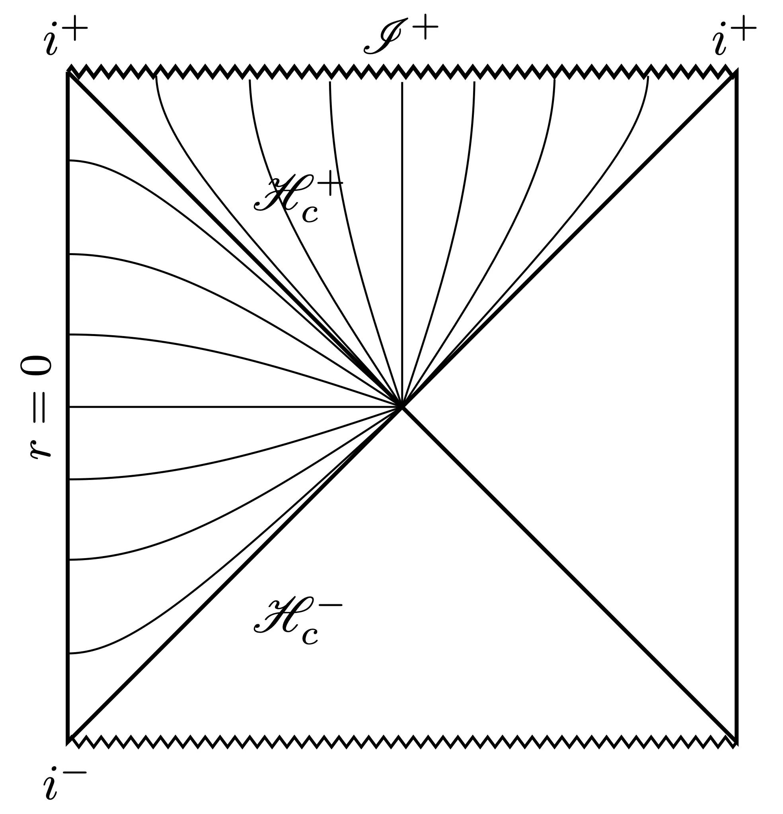
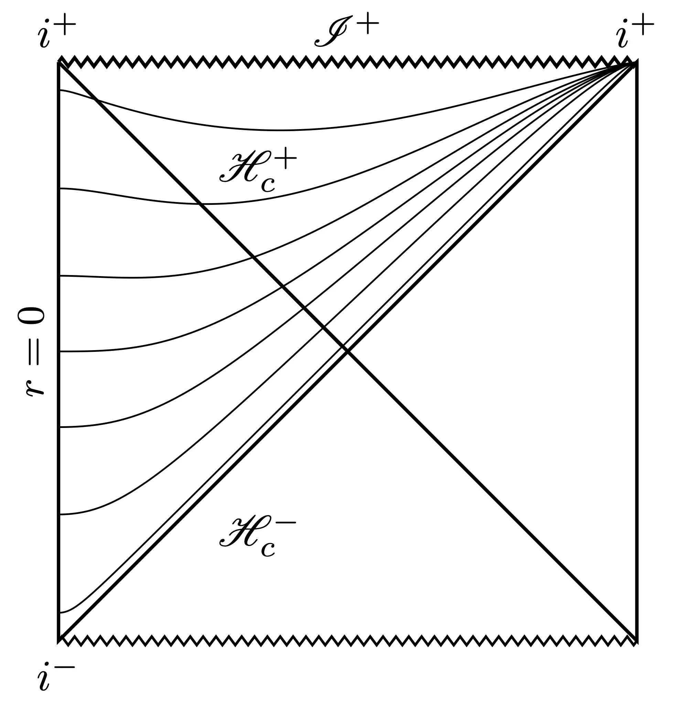

[Charles W. Misner](https://en.wikipedia.org/wiki/Charles_W._Misner) passed on July 24, 2023, and there was a lovely [memorial symposium](https://umdphysics.umd.edu/events/misnersymposium.html) at the University of Maryland on November 11, 2023, to celebrate his life. Misner was a prolific scientist who significantly influenced the early developments of general relativity during its first [golden age](https://en.wikipedia.org/wiki/History_of_general_relativity#Golden_age). His last three submissions on the arXiv are on hyperboloidal compactification, a rather niche topic in relativity that happens to be my research area, so I wrote this post about it.

The symposium gave an excellent overview of Misner's work and provided some insight into his character. Misner is most widely known as the "M" in [MTW](https://en.wikipedia.org/wiki/Gravitation_(book)) and [ADM](https://en.wikipedia.org/wiki/ADM_formalism)[^gravitation]. One cannot possibly discuss every topic that Misner influenced in a single day, so, inevitably, some of his research areas were left out; among them was his work on hyperboloidal methods. Below are Misner's last three submissions on the arXiv.
- [Hyperboloidal Slices and Artificial Cosmology for Numerical Relativity](https://arxiv.org/abs/gr-qc/0409073) (2004) published as part of [Deserfest](https://www.worldscientific.com/worldscibooks/10.1142/5688),
- [Over the Rainbow: Numerical Relativity beyond Scri+](https://arxiv.org/abs/gr-qc/0512167) (2005),
- [Excising das All: Evolving Maxwell waves beyond scri](https://arxiv.org/abs/gr-qc/0603034) with James R. van Meter and David R. Fiske (2006) published in [PRD](https://doi.org/10.1103/PhysRevD.74.064003).

Misner's main idea is to add an artificial cosmological constant to the Einstein equations to help with hyperboloidal compactification. Below, I will discuss his idea in two sections. 

First, the [coordinates](#the-coordinates). Misner proposes a hyperboloidal compactification in the toy model of de Sitter spacetime to demonstrate his idea. The coordinates he proposes are, in my opinion, not particularly useful. We now have a good understanding of hyperboloidal compactification that wasn't available then. I will discuss his coordinates based on our current understanding.

Second, the [artificial cosmological constant](#artificial-cosmological-constant). Misner proposes to modify the Einstein equations with a small cosmological constant to stabilize hyperboloidal evolution. This is a very interesting and promising idea that, to my knowledge, has never been tried before.

## The coordinates
The main construction is clearly laid out in Misner's [first paper](https://arxiv.org/abs/gr-qc/0409073) prepared for the celebration of his long-time collaborator [Stanley Deser](https://en.wikipedia.org/wiki/Stanley_Deser). The other papers are commentary, demonstration, and further development.

Before discussing the coordinates, we'll review our current understanding of hyperboloidal regularization of coordinate singularities to put Misner's construction in context.

### Spacelike regularization of coordinate singularities
Take a spherically symmetric, stationary spacetime. For brevity, we'll ignore the spherical part of the spacetime and discuss only the $\\{t,r\\}$ plane. We write the metric as
$$ ds^2 = - f(r) dt^2 + \frac{1}{f(r)} dr^2. $$
We get Minkowski with $f=1$, Schwarzschild with $f=1-\frac{2M}{r}$, or de Sitter with $ f = 1-\frac{r^2}{L^2}$. There's a (coordinate) singularity where $f$ vanishes: the event horizon of Schwarzschild at $r=2M$ or the cosmological horizon of de Sitter at $r=L$. From the conformal point of view, spatial infinity is also a coordinate singularity, but it's not visible on the metric without compactification.

After decades of confusion following Schwarzschild's first publication of the Schwarzschild metric, we now know that a suitable re-slicing of spacetime (a different definition of time) resolves such coordinate singularities. There are many different ways to do this, but, especially for numerics, we'd like to maintain the time symmetry of the background when introducing a new time function. Otherwise, the coefficients of the transformed metric depend on time. The time symmetry is respected by transformations of the form
$$ \tau = t + h(r).$$ 
The function $h(r)$ is called the height function because it describes the height of the new coordinate $\tau$ with respect to $t$ when plotted on the $\\{t,r\\}$ plane. This transformation leaves the time derivatives invariant as intended: $\partial_t = \partial_\tau$. The metric becomes
$$ ds^2 = - f d\tau^2 + 2 f H \ d\tau dr + \frac{1-f^2 H^2}{f} dr^2, $$
where we have defined $H:=dh/dr$. Regularization refers to choosing a suitable $H$ such that the $rr$-component of the above metric is regular at the zeros of $f$. This requirement implies $fH \sim \pm 1$ at those zeros. Spacelike regularization ensures that $\tau$ is a time coordinate with spacelike level sets, which implies $|fH|<1$ away from the zeros of $f$. The sign of $H$ determines the orientation with respect to the null cone: whether we resolve the white hole or the black hole, past null infinity or future null infinity. If you compare the time transformation above with the null coordinates, $u=t-r$ and $v=t+r$, you can see that the slicing resembles outgoing null rays, $u$, for $H<0$ and ingoing null rays, $v$, for $H>0$.

Hyperboloidal coordinates provide a spacelike regularization of the coordinate singularity for the conformal metric at spatial infinity. The name "hyperboloidal" comes from the asymptotic similarity of this construction to the behavior of standard hyperboloids in suitable coordinates:
$$\tau = t - \sqrt{1+r^2}. \tag{1} \label{1} $$
To see that this is a hyperboloid, think of it as $(\tau-t)^2 - r^2 = 1$. For large $r$, the hyperboloidal coordinate $\tau$ approaches the null coordinate $u$ but has spacelike level sets everywhere. The defining property of hyperboloidal coordinates is the spacelike regularization of coordinate singularities at null horizons. I wrote more about this in the context of [hyperbolic geometry for special relativity](/post/hyperbolic-relativity/) or [splitting spacetime into space and time](/post/2023/splitting-spacetime/).

In asymptotically flat spacetimes, hyperboloidal regularization allows us to fix future null infinity[^scri] at a constant spatial coordinate ([scri-fixing](../../../publication/zenginoglu-2008-hyperboloidal/)). In black hole spacetimes, spacelike regularization leads to horizon-penetrating coordinates crucial for the excision of black hole interiors. In cosmological spacetimes, it allows us to perform numerical simulations, including the cosmological horizon. The cosmological case is what Misner discusses in his papers.

### de Sitter spacetime
We get de Sitter spacetime with[^patch]
$$ f = 1 - \frac{r^2}{L^2}. $$
As mentioned above, there is a coordinate singularity at the cosmological horizon, $r=L$, where $f$ vanishes. The hallmark of the coordinate singularity is intersecting time slices in the conformal diagram[^diagrams]. 

We want to construct a regularization of the future cosmological horizon. The null cone structure is given by $u=t-r_\ast$ and $v=t+r_\ast$ with $r_\ast = \int \frac{dr}{f} = L \ \mathrm{archtanh }\ \frac{r}{L}$. We are primarily interested in the domain up to the cosmological horizon, $r\leq L$. Here's a suitable choice that satisfies our two requirements ($fH \to - 1$ as $r\to L$ and $|fH|<1$ for $r<L$):
$$ f H = - \frac{r^2}{L^2}.$$ 
By integration, we get the new time coordinate
$$\tau = t + r - L \ \mathrm{archtanh }\ \frac{r}{L}.$$
The metric becomes
$$ ds^2 = - f d\tau^2 - \frac{2 r^2}{L^2} d\tau dr + \left(1+\frac{r^2}{L^2}\right) dr^2. $$
This metric is particularly nice because it can be written in Kerr-Schild form[^kerrschild] as the sum of the Minkowski metric and a scaled null field
$$ ds^2 = - d\tau^2 + dr^2 + \frac{r^2}{L^2} \left(d\tau - dr\right)^2. $$
The singularity at the cosmological horizon $r=L$ is resolved. This construction allows us to perform numerical calculations including the cosmological horizon. The time slices resolve the coordinate singularity in the previous conformal diagram. Instead, we obtain a smooth foliation of the cosmological horizon, as seen below. The diagram also demonstrates that Kerr-Schild coordinates beyond the horizon resemble trumpet slices in black hole spacetimes. 

Misner takes the Kerr-Schild form of the de Sitter metric as a starting point and adds another time transformation
$$ T = \tau - \sqrt{1+r^2}. $$
This is what he calls hyperboloidal. The transformation is formally that of the standard hyperboloid as in Eq. \eqref{1}, but applying this in the geometry of de Sitter spacetime is awkward. The point of the standard hyperboloid is that asymptotically in Minkowski spacetime (for large $r$), the transformed time coordinate approaches the outgoing null cone: $T\sim t - r$. However, the outgoing null cone in de Sitter spacetime does not have this form; therefore, the transformation is not hyperboloidal with respect to the actual background. As the time transformation doesn't respect the underlying causal structure of de Sitter spacetime, it does nothing to regularize an already regular coordinate system. Nevertheless, let's write down the metric
$$ ds^2 = -f dT^2 - 2 \left( \frac{r}{L^2} + \frac{f}{\sqrt{1+r^2}} \right) dT dr $$ 
$$ + \frac{L^2 + r^2 + 2 r^4 - 2r^3\sqrt{1+r^2}}{L^2 (1+r^2)} dr^2. $$

The only impact of this transformation on the asymptotic behavior of the time slices is when $L=1$ or when the coefficient of $r$ in the hyperboloid matches the cosmological radius. In this case, the time slices end at future spacelike null infinity, $\mathscr I^+$, instead of future timelike infinity, $i^+$. 

Next, Misner introduces the spatial compactification
$$ r = \frac{\rho}{1-\left(\frac{\rho}{2}\right)^2}. $$
Remember that future null infinity, $\mathscr I^+$, is spacelike in cosmological spacetimes. The compactification maps $\mathscr I^+$ to $\rho=2$. But no compactification is needed if we're interested in the cosmological horizon, which is at a finite distance. One can consider $r$ already as a compactification of the tortoise coordinate $r_*$. In the case of de Sitter, the cosmological horizon at $r=L$ acts as the ingoing null surface representing a far-away observer. We don't need to access spacelike null infinity, so the compactification seems unnecessary. Compactification might be useful for very large $L$, but even then, what we need is not necessarily a compactification but a mapping of the cosmological horizon to a coordinate sphere whose location is independent of the cosmological constant.

That's all I have to say about the coordinates. There are better choices if you want to evolve fields accurately in asymptotically de Sitter spacetimes. But Misner's goal is not to evolve fields on the background of asymptotically de Sitter spacetimes. He aims to evolve the Einstein equations to construct astrophysically relevant asymptotically flat spacetimes using an *artificial* cosmological constant. And that's a very promising idea.

## Artificial cosmological constant
Let's say we are interested in solving the Einstein equations for gravitational waves propagating large distances along outgoing null geodesics, all the way up to and including future null scri. To include scri, we solve the equations for a conformally rescaled metric $g= \Omega^2 \tilde{g}$ following [Penrose](https://journals.aps.org/prl/abstract/10.1103/PhysRevLett.10.66). The conformal Einstein equations read
$$ R_{\mu\nu} - \frac{1}{2} g_{\mu\nu} R = T_{\mu\nu}[\Omega], $$
with conformal source terms
$$ T[\Omega] = -\frac{2}{ {\color{darkred}\Omega}} \left(\nabla_\mu \nabla_\nu \Omega - \Box \Omega g_{\mu\nu}\right) - \frac{3}{ {\color{darkred}\Omega^2} } \nabla_\lambda \Omega \nabla^\lambda \Omega g_{\mu\nu}. $$
The conformal factor vanishes at future null infinity which is a subset of the conformal boundary of spacetime where $\Omega=0$. If we want to include the conformal boundary in our numerical computations, we must somehow deal with the formal singularity of these terms at $\Omega=0$. I write "formal singularity" because one can show that the terms are regular under reasonable assumptions. However, it's hard to impose that regularity on hyperboloidal surfaces while keeping the evolution numerically stable.

Misner's idea is to add a small cosmological term to the equations
$$ R_{\mu\nu} - \frac{1}{2} g_{\mu\nu} R {\color{darkgreen} - \frac{3}{L^2 \Omega^2} g_{\mu\nu}} = T_{\mu\nu}[\Omega]. $$
For large $L$, this term can be as small as we want as long as $\Omega>0$. However, the global causal structure of spacetime is dramatically different at $\Omega=0$. Null infinity is not a null surface anymore; it's a spacelike surface! Even the definition of gravitational radiation becomes difficult and is an [ongoing research topic](https://arxiv.org/abs/1409.3816).

Misner's insight is that we don't have to evolve the fields until the conformal boundary. It's sufficient to go slightly beyond the cosmological horizon and stop at a spacelike surface. In Misner's approach, **the conformal factor does not vanish anywhere on the grid**! This method mimics the excision method inside a black-hole (apparent) horizon. For large $L$, the resulting radiation field should match the radiation field in the asymptotically flat case. We consider the cosmological constant an artificial term, a numerical trick, allowing us to apply excision beyond the cosmological horizon. This is the core idea of Misner's approach: excise the unobservable universe beyond the cosmological horizon.

### Potential advantages

Theoretically, this approach provides all the benefits of hyperboloidal compactification: improved efficiency, no artificial boundary conditions, and no radiation extrapolation problem. In addition, one can expect improved stability due to the artificial cosmological constant. There are some caveats that I'll mention; I think they are manageable in practical numerical work.

#### Efficiency
In the asymptotically flat scenario, the numerical efficiency comes from the time transformation that stretches the spatial wavelength of outgoing waves. This wave-stretching, or redshift, is then combined with compactification to resolve oscillatory solutions on infinite domains.

In the cosmological scenario, the waves are also stretched, but the interpretation of wave-stretching is now due to the expansion of space and is called cosmological redshift. The **caveat** is that the cosmological redshift is a physical effect. The cosmological constant changes the waveform physically. I expect that the impact of a sufficiently small cosmological constant will be negligible on the waveform but significant on numerical efficiency because of the different roles of time and space in the construction for large $L$. 

#### Boundary conditions
In the asymptotically flat scenario, no numerical boundary conditions are needed because one places the outer boundary at future null infinity, which is an ingoing null surface. No signals can propagate faster than the speed of light, so no characteristics can enter the numerical domain.

In the cosmological scenario, the outer boundary is spacelike. This is even better than an ingoing null boundary. A spacelike boundary will pull away any perturbations and further stabilize the code. This setup emulates excision at the black hole horizon. Consider the conformal diagrams above and think of spacelike null infinity, $\mathscr I^+$, as the spacelike black-hole singularity and the cosmological horizon as the event horizon. 

#### Radiation extrapolation
In the asymptotically flat scenario, gravitational waves are defined unambiguously at future null infinity. With the numerical outer boundary placed at future null infinity, one can directly read off the asymptotic fields and perform the relatively simple transformations to extract the gravitational radiation without any error-prone extrapolation procedures.

In the cosmological scenario, one would read off the radiation at the cosmological horizon. For large $L$, this radiation should match the radiation at future null infinity. Again, no extrapolation would be needed because the cosmological horizon is part of the simulation domain. The **caveat** is that there is no unambiguous (coordinate-independent) definition of gravitational radiation at the cosmological horizon. In fact, the horizon itself depends on the coordinate system, even in pure de Sitter spacetime. We'll need to understand this problem better once we have stable simulations. Note that the cosmological constant in our Universe is non-vanishing, so this problem is physically interesting and has been an ongoing research topic by [Ashtekar](https://arxiv.org/abs/1409.3816), [Bonga](https://arxiv.org/abs/2306.08029) and collaborators.

#### Stability
It is well-known that de Sitter spacetimes are "more stable" than asymptotically flat spacetimes. [Friedrich](https://link.springer.com/article/10.1007/BF01205488) demonstrated the stability of asymptotically de Sitter spacetimes in 1986, years before the stability of Minkowski spacetimes was proven. We also know from [Bizoń and Rostworowski](https://arxiv.org/abs/1104.3702) that AdS with no-flux boundary conditions is globally unstable. The flat case is, in some imprecise sense, at the edge of stability with respect to the cosmological constant. A positive constant moves us towards better stability.

## Beyond the horizon there be monsters
Hyperboloidal evolution of astrophysically relevant phenomena (binary black holes, neutron stars) is an open problem in numerical relativity. Today, the effort is driven mostly by David Hilditch and Alex Vañó-Viñuales. Since I gave up on this hard problem in 2013, this is the most exciting idea that I haven't tried yet. Exciting because I can't think of a reason why this shouldn't work. There may be monsters behind the horizon that I'm not yet aware of but it's certainly worth tinkering for a few months.

It would be remarkable if Misner's suggestion would lead to a resolution of this important open problem. Can't wait to see the outcome.

<!-- The biggest frustration with this problem for me is that it's a hard binary: it works or it doesn't. And when it doesn't work, you can't do anything incremental to improve it. This idea is different. We know that evolution with a cosmological constant will work. Once we have a stable code, we can improve it bit by bit using smaller cosmological constants, better coordinates, improved extraction schemes, etc. -->

[^gravitation]: MTW is named after Misner, Thorne, and Wheeler, who are the authors of the book [Gravitation](https://en.wikipedia.org/wiki/Gravitation_(book)). ADM stands for Arnowitt, Deser, and Misner. We learned in the memorial symposium that Deser and Misner were both invited by Niels Bohr to the institute known as Niels Bohr Institute today. They worked in a school building on an island near Copenhagen during the summer of their visit, kneeling on the low blackboard designed for school children to make their calculations.
[^patch]: The coordinates we use here cover only part of the de Sitter spacetime called the static patch. There are many other coordinate systems that don't exhibit a singularity at the cosmological horizon. For example, [global coordinates](https://en.wikipedia.org/wiki/De_Sitter_space#Closed_slicing) are regular everywhere and can be used to construct conformal diagrams. However, the static patch is helpful for numerical calculations because the time symmetry is explicit in the coordinates.  
[^regularization]: I'm using hyperboloidal regularization at null horizons in a more general sense than is usually associated with hyperboloidal surfaces. For example, horizon-penetrating coordinates such as [Eddington-Finkelstein](https://en.wikipedia.org/wiki/Eddington–Finkelstein_coordinates) and [Painlevé-Gullstrand](https://en.wikipedia.org/wiki/Gullstrand–Painlevé_coordinates) coordinates are hyperboloidal. To see this, consider the areal radius $r$ as a "compactification" of the tortoise coordinate $r_\ast$. Ingoing Eddington-Finkelstein coordinates are obtained by constructing characteristic preserving hyperboloidal compactification from Schwarzschild $t$ and tortoise $r$ by requiring $t_{iEF} + r = t + r_*$.
[^diagrams]: If you're interested in how to draw such conformal diagrams, see my [blog post](/post/2022/drawing-penrose-diagrams).
[^cosmological]: The cosmological constant $\Lambda$ in the Einstein equations is related to the cosmological length scale by $\Lambda = \frac{3}{L^2}$.
[^kerrschild]: The Kerr-Schild form of a metric is $g_{\mu\nu} = \eta_{\mu\nu} + F\ k_\mu k_\nu$, where $\eta_{\mu\nu}$ is the Minkowski metric and $k_\mu$ is a null vector. 
[^patch]: The coordinates we use here cover only part of the de Sitter spacetime called the static patch. There are many other coordinate systems that don't exhibit a singularity at the cosmological horizon. For example, [global coordinates](https://en.wikipedia.org/wiki/De_Sitter_space#Closed_slicing) are regular everywhere and can be used to construct conformal diagrams. However, the static patch is helpful for numerical calculations because the time symmetry is explicit in the coordinates.  
[^diagrams]: If you're interested in how to draw such conformal diagrams, see my [blog post](/post/2022/drawing-penrose-diagrams).
[^cosmological]: The cosmological constant $\Lambda$ in the Einstein equations is related to the cosmological length scale by $\Lambda = \frac{3}{L^2}$.
[^scri]: Null infinity (or scri for "script I" $\mathscr I$) consists of the set of endpoints of null geodesics. In asymptotically flat spacetimes, null infinity is an ingoing null surface. In asymptotically de Sitter spacetimes, null infinity is a spacelike surface so we write "spacelike null infinity." For more detail about the properties of the conformal boundary, see Frauendiener's review [Conformal Infinity](https://link.springer.com/article/10.12942/lrr-2004-1) or Valiente Kroon's book [Conformal Methods in General Relativity](https://www.cambridge.org/core/books/conformal-methods-in-general-relativity/72AC946BEF2C74BD5D0AB790B31FAEB7).
<!-- If scri as a hypersurface is null, we say null scri. For example, asymptotically de Sitter spacetimes have a spacelike scri; asymptotically Anti-de Sitter spacetimes have a timelike scri. This usage avoids the confusing terminology around "null infinity" where it's unclear whether "null" refers to null geodesics or null generators. This is not standard usage but it's helpful to make the distinction when considering cases with non-vanishing cosmological constant. For more detail about the conformal boundary, see Frauendiener's review [Conformal Infinity](https://link.springer.com/article/10.12942/lrr-2004-1) or Valiente Kroon's book [Conformal Methods in General Relativity](https://www.cambridge.org/core/books/conformal-methods-in-general-relativity/72AC946BEF2C74BD5D0AB790B31FAEB7). -->

<!-- [^terminology]: There are two ways to add a qualifier to infinity, scri, or $\mathscr I$. You may call infinity, or $\mathscr I$, null, because it consists of endpoints of null geodesics or because its generators are null vector fields (in asymptotically flat spacetimes). There is usage for both in the literature. I'm following here Hawking \& Ellis so $\mathscr I$ in de Sitter is spacelike infinity. A better usage would define scri as the endpoints of null geodesics and talk about  -->

<!-- One of the most influential events on my career was the funeral of [Jürgen Ehlers](https://en.wikipedia.org/wiki/J%C3%BCrgen_Ehlers), another giant of general relativity who was the founding director of the Max-Planck Institute for Gravitation where I did my Ph.D. thesis.  -->
