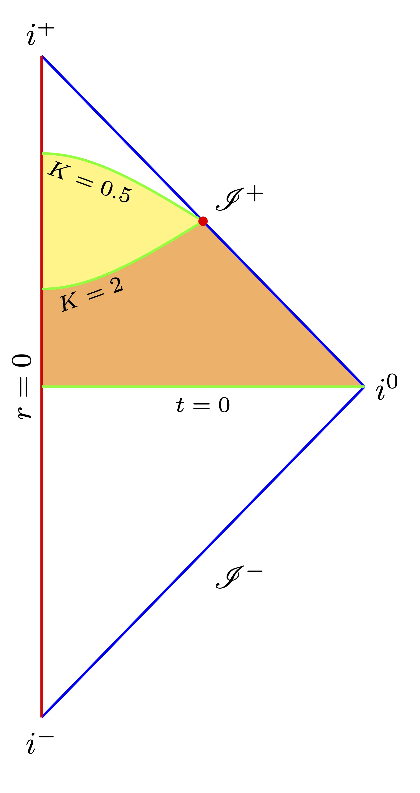

## Predicting the future
Contrary to common belief, physicists are in the business of making predictions more than fortune tellers or astrologers. The hows and whys, the fundamentals and principles, "whether or not the world has three dimensions," all boil down to one question: Can you predict the future?

Predicting the future for a physicist is, of course, a much more accurate undertaking than for fortune tellers, astrologers, or [economists](https://www.yahoo.com/news/finance/news/wall-street-economists-consistently-wrong-171740454.html). We want to know what happens to well-defined variables describing the mathematical idealization of a natural system given a snapshot in time[^snap]. 

We call this process "solving an initial value problem." We solve an equation of motion, typically a partial differential equation (PDE), with prescribed initial data. The PDE is the mathematical idealization of our model of the physical system under consideration. That's where all the whys and hows go. The PDE describes how the chosen variables of the system vary in relation to each other. The initial data is the snapshot of these variables at a given time. The solution to this initial value problem is our prediction of the future.

The language of a snapshot in time distinguishes time and space. But didn't special relativity teach us that time by itself and space by itself are mere shadows? Well, it did, and it didn't. Special relativity taught us that the notion of time and simultaneity is observer-dependent. But time is still a special dimension in a relativistic spacetime, distinct from its spatial friends. For example, the metric has the signature $(-+++)$, and the one that doesn't belong is time. Time is special.

To formulate an initial value problem, we need to split spacetime into space and time. In relativity, there are three approaches to splitting spacetime to formulate an initial value problem: Cauchy, characteristic, and hyperboloidal. Let's take the flat, 1+1 dimensional spacetime to demonstrate these approaches. In standard coordinates $(t,r)$, the flat metric reads
$$ ds^2 = -dt^2 + dr^2 \tag{1} \label{1} $$ 
The most intuitive approach is to take the snapshot at $t=0$. The corresponding surface[^surf] is called a [Cauchy surface](https://en.wikipedia.org/wiki/Cauchy_surface) and has specific desirable properties that generalize to more interesting cases. The associated [Cauchy problem](https://ems.press/books/esi/66) plays a central role in mathematical and numerical relativity.

We also have null surfaces in relativity, named as such because they provide the [nullspace](https://en.wikipedia.org/wiki/Kernel_(linear_algebra)) of the metric \eqref{1} through $t\pm r$. This null cone is fundamental in many aspects. First, it determines the [causal structure of spacetime](https://plato.stanford.edu/entries/spacetime-singularities/lightcone.html). Second, it describes the propagation of disturbances. In particular, massless fields propagate along the null cone. Even before the advent of relativity, it was known that disturbances to solutions of wave equations propagate along these special surfaces called [characteristics](https://en.wikipedia.org/wiki/Method_of_characteristics). One can provide data on such characteristic surfaces and solve a [characteristic evolution problem](https://link.springer.com/article/10.12942/lrr-2012-2). This approach is particularly valuable in the modern era of gravitational-wave astronomy because gravitational waves are only defined at infinity along outgoing null directions.

## Hyperboloidal surfaces

The hyperboloidal approach is the odd one. You take a spacetime hyperboloid, say 
$t^2 - r^2 = 1,$
and give initial data on the surface defined by 
$t(r) = \sqrt{1+r^2}.$ 
This construction seems weird and arbitrary when you first encounter it. Why would you do something like this? How is this surface a _snapshot_? Why not pick another transformation?

Many relativists feel that hyperboloidal surfaces are somewhat unnatural, lacking the simplicity and elegance of the Cauchy or characteristic approaches. The usual argument goes like this: spacelike surfaces constructed by far-away observers are necessarily hyperboloidal. But this is an asymptotic argument that requires familiarity with Penrose diagrams as mathematical idealizations. It's not intuitive. Below, I demonstrate how hyperboloidal surfaces extend the mathematical notion of a sphere to relativity and satisfy a physical principle, which, hopefully, is more intuitive for splitting spacetime into space and time. The concepts that we'll encounter will lead us to speculations in the quantum realm.

### Mathematical notion
_Hyperboloids as analogs of spheres in spacetime._

A circle is a set of points equidistant from a given point. This definition is among the purest in mathematics[^groth]. To derive the equation for a circle, consider the Euclidean metric in two dimensions
$$ ds^2 = dx^2 + dy^2. $$
The set of points $\\{x,y\\}$ at distance $R$ from the origin satisfies
$$ x^2 + y^2 = R^2. $$
The circle (or sphere in three dimensions) is the simplest nontrivial example of a constant curvature surface, with its curvature being the reciprocal of its radius, $K=1/R$. Now, let's consider the corresponding object in relativity.

**What is the set of events equidistant from a given event?**

In the relativistic setting, spacetime distance is proper time. Using the metric \eqref{1}, the set of events $\\{t, r\\}$ at proper time $T$ from the origin satisfies
$$ - t^2 + r^2 = \pm T^2. $$
This equation describes a spacetime hyperbola. The sign in the equation determines whether the hyperbola is spacelike or timelike[^sign]. We'll pick the negative sign for the spacelike hyperbola because we aim to construct a snapshot. I mentioned before that time is special, so let's solve the above equation for time to obtain the future sheet of the spacelike hyperbola
$$ t(r) = \sqrt{T^2+r^2}.$$
This spacelike surface consists of points at proper time $T$ from the origin. Like the circle above, this surface has constant curvature, $K=1/T.$ The higher dimensional version of a hyperbola is called the hyperboloid.

We see that hyperboloids are the relativistic analogs of spheres. Hyperboloids are as natural in Lorentzian manifolds as spheres are in Riemannian manifolds.

### Physical principle
_Hyperboloids as analogs of soap bubbles in spacetime._

.")

The circle has another attractive property: among all figures with a given area, the circle has the smallest perimeter. We've known this for over 2,000 years[^zenod]. The corresponding statement for the sphere was only proven in the 19th century by [Schwarz](https://en.wikipedia.org/wiki/Hermann_Schwarz). Such optimization problems appear in many areas. One that is familiar to most people from early childhood is the soap bubble.

In mathematical terms, soap bubbles are minimal surfaces enclosing a fixed volume of air. The variational problem has the following action
$$ S = A - \lambda \cdot V. \tag{2} \label{2} $$
Minimize the area $A$ with the constraint that the volume $V$ is fixed. The mathematics of soap bubbles includes fascinating open problems with many [recent developments](https://www.quantamagazine.org/monumental-math-proof-solves-triple-bubble-problem-and-more-20221006/). Frank Morgan, who proved the [double bubble theorem](https://en.wikipedia.org/wiki/Double_bubble_theorem), has a wonderful lecture on the topic.


 
Here's a particularly relevant quote from the lecture

> "If you want to understand the universe, start out by understanding the soap bubble."
> 
> Frank Morgan

Let's try to understand the universe by understanding the soap bubble. We must first answer the following question as we did with the circle:

**What is the relativistic analog of a soap bubble?** 

Formally, we can use the action for the soap bubble \eqref{2} and go one dimension higher.
$$ S = V - \lambda \cdot W. \tag{3}\label{3} $$
Now, the task is to _maximize the volume_ $V$ with the constraint that the _spacetime volume_ $W$ is fixed. In contrast to the soap bubble problem, we're not looking for a minimal hypersurface in the relativistic setup but a maximal one. The minimal hypersurface would be null with vanishing volume.

Let's see the solution of this problem in a simple case. We compute the relativistic volume by integrating the square root of the determinant of the metric[^asd]. Denoting the determinant of the induced metric on the hypersurface by $h$ and the determinant of the spacetime metric by $g$, we have 
$$ S = \int \sqrt{h}\ d^3x - \lambda \int \sqrt{-g}\ d^4x. $$
The extremization of this action leads to the requirement of constant mean curvature: $K = \lambda$, where $K$ is the trace of the extrinsic curvature[^brill]. We'll do this for the 1+1 Minkowski metric to find an explicit expression for the maximizer. We're looking for an embedding, $t=t(r)$, that maximizes the action for the relativistic bubble. The induced metric is
$$ ds^2 = -dt^2 + dr^2 = \left(-t'^2 + 1\right) dr^2, $$
where $t'\equiv dt(r)/dr$. The volume from the origin to some radius $R$ is
$$ V = \int_0^R \sqrt{h} \ dr = \int_0^R \sqrt{1-t'^2}\ dr. $$
To calculate the spacetime volume, we need a reference surface. It turns out that it doesn't matter which surface, so let's just take the surface $t=0$. The spacetime volume is given by 
$$ W = \int_0^R \int_0^{t(r)} \sqrt{-g} \ dt dr = \int_0^R t(r) dr. $$
Bringing these expressions together in the action \eqref{3}, we can read off the Lagrangian density
$$ \mathscr{L} = \sqrt{1-t'^2} - \lambda t. $$
The Euler-Lagrange equation for varying $t(r)$ with respect to the parameter $r$ reads
$$ \frac{d}{dr} \frac{\partial\mathscr{L}}{\partial t'} = \frac{\partial \mathscr{L}}{\partial t} \ \iff \
 \frac{d}{dr} \frac{t'}{\sqrt{1-t'^2}} = \lambda. $$
We integrate by $r$ and solve for $t'$ with the boundary condition $t'(0)=0$
$$ t'(r) = \pm \frac{\lambda r}{\sqrt{1+ \lambda^2 r^2}}. $$
By choosing the positive sign and integrating again, we get the equation for the spacetime hyperboloid 
$$ t(r) = \sqrt{\frac{1}{\lambda^2} + r^2}. $$
We recognize the mean extrinsic curvature as $K=\lambda$ from our previous discussion on the relativistic analog of a circle. We now see that the hyperboloid is the relativistic analog of a soap bubble.

You may wonder what determines the value of the constant mean curvature. It's the spacetime volume that we prescribe in the constraint. The larger the spacetime volume to be enclosed, the smaller the constant mean curvature. You can see this behavior in the Penrose diagram below. As I mentioned above, the reference surface doesn't matter for the qualitative discussion. You can pick $t=0$ or $u=t-r=0$. The spacetime volume enclosed by the hyperboloid with $K=0.5$ is larger than the spacetime volume enclosed by the one with $K=2$ in both cases. The difference is shaded yellow.

This behavior is actually very intuitive, as it's the same for a soap bubble. The larger the volume of air that the bubble needs to enclose, the larger the bubble, and therefore the smaller the curvature of the bubble.

In summary, there's a clear analogy between soap bubbles and hyperboloids. Soap bubbles are minimal surfaces enclosing a fixed volume of air. Hyperboloids are maximal surfaces enclosing a fixed volume of spacetime.

## Quantum foam

What would the extremization of the action \eqref{3} mean physically? Does space arise from the extremization of spacetime bubbles?

It has been long predicted that spacetime shouldn't be smooth at the Planck scale due to quantum fluctuations. It should be "foamy," or "bubbly," or "grainy," or whatever you want to call it. Wheeler, the naming authority of theoretical physics, called this the [quantum foam](https://en.wikipedia.org/wiki/Quantum_foam). A foam is defined as a dispersion of bubbles, and we have just seen that the relativistic generalization of a bubble is a hyperboloid. 

We arrived at the realm of speculation. We don't know how to test the quantum foam idea experimentally. But we can imagine that quantum foam arises from quantum fluctuations of spacetime bubbles. The hypersurfaces that enclose those bubbles are hyperboloids. As usual, this mental image gives rise to further questions. What is the mechanism for the formation of such hyperboloids? How are they related to quantum fields?

One idea is that the hypersurfaces arise through entanglement. I've written about [hyperboloidal holography](../../hyperboloidal-holography/) before, where I argued that holographic entanglement entropy naturally extends to flat spacetime if we use hyperboloids as time slices. The variational principle suggests that these surfaces could also be useful in the context of [quantum complexity](https://www.quantamagazine.org/in-new-paradox-black-holes-appear-to-evade-heat-death-20230606/). 

These speculations open more questions than answers. Nevertheless, we now have a better sense that soap bubbles and their clusters may indeed provide a key to understanding spacetime.

---

[^snap]: To be fair, not all physical theories focus on snapshots in time. There are theories formulated in terms of statistical ensembles, boundary value problems, or, as discussed in this post, variational principles. But there is a sense in which all these also arise from initial value problems under certain conditions. 
[^surf]: I'll sometimes refer to lines as (hyper)surfaces and circles as spheres. I'm demonstrating the mathematics in the simplest case with one spatial dimension, but the concepts generalize trivially to three-dimensional space.
[^sign]: Timelike hyperbolas describe observers with uniform acceleration, called [Rindler observers](https://en.wikipedia.org/wiki/Rindler_coordinates), and play an important role in quantum field theory in curved spacetimes, among others.
[^groth]: A fascinating [story on Grothendieck's life](https://www.newyorker.com/magazine/2022/05/16/the-mysterious-disappearance-of-a-revolutionary-mathematician) mentions his first encounter with this definition as a twelve year old boy at an internment camp in France.
[^zenod]: This statement in a slightly different form was first asserted by [Zenodorus](https://en.wikipedia.org/wiki/Zenodorus_(mathematician)), who stated that a circle has a greater area than any polygon with the same perimeter. You can find a lovely account of the evolution of the isoperimetric problem [here](https://maa.org/sites/default/files/pdf/upload_library/22/Ford/blasjo526.pdf).
[^asd]: To understand how we compute volumes in relativity, read a bit about [volume forms](https://en.wikipedia.org/wiki/Volume_form). 
[^brill]: I'm not going through the general calculation here to avoid introducing lots of definitions, but the calculation itself is very short and can be found, for example, in the paper by [Brill, Cavallo, and Isenberg](https://pubs.aip.org/aip/jmp/article-abstract/21/12/2789/444574/K-surfaces-in-the-Schwarzschild-space-time-and-the) from 1980. 
