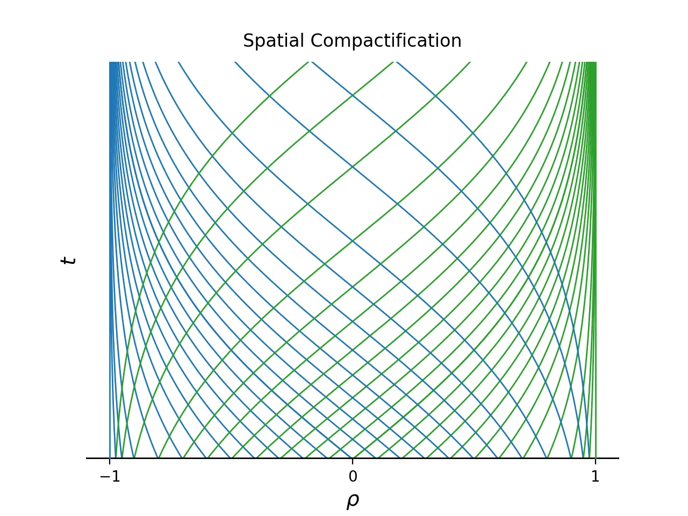
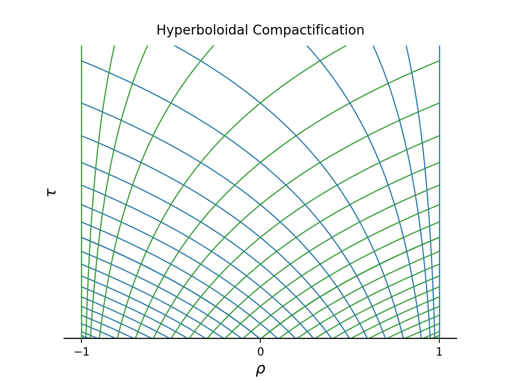
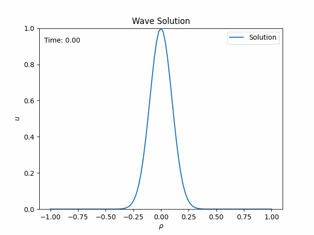

This post is a practical guide to numerically solving wave equations on unbounded domains. Using standard numerical methods, I demonstrate a technique called *hyperboloidal compactification* to solve unbounded-domain wave equations directly (no truncation, no artificial boundaries) by mapping the unbounded domain to a finite domain. 

Code for the demonstrations uses public libraries and is available as a Google Colab notebook so that you can run everything from a browser.

<a target="_blank" href="https://colab.research.google.com/drive/1w-cmd1UEWqQ6Bu1rHnfASp1ue7eCPLl4?usp=sharing">
  
</a>

## Why waves?
Our most important senses, sight and sound, rely on waves. Electromagnetic and acoustic waves carry information from an external reality far from the immediate neighborhood of our body to our audiovisual system. Our current understanding of the fundamental building blocks of the Universe is based on waves. Quantum field theory models all elementary particles as wave-like excitations of quantum fields. Most remarkably, we have recently gained the ability to detect gravitational waves, or spacetime waves, from the most energetic phenomena in the Universe happening billions of light years away.

The ability to understand waves by solving the equations that describe them is essential also for practical applications, such as modeling of earthquakes (seismology), ocean waves and tsunamis (oceanography), sonar systems (acoustics), radar scattering off airplanes and antenna design (electromagnetism), among others. 

But you probably didn't need that motivation if you're reading this.

## The mathematical model
The simplest equation that describes a wave is aptly named the wave equation. We'll consider the case with one space dimension
$$ \left(-\partial_t^2 + \partial_x^2\right) u(x,t) = 0. \tag{1} \label{1}$$
The acceleration (or curvature in time), $\partial_t^2$, is balanced by the curvature in space, $\partial_x^2$. This delicate balance leads to solutions that propagate while maintaining their form. In one dimension, there are only two directions a wave can propagate, and we get the general solution
$$ u(x,t) = f_+(x-t) + f_-(x+t). $$
The functions $f_\pm$ travel unchanged along the curves $x\pm t$. We call these curves *characteristics*. The characteristics extend infinitely in both directions. 

We solved \eqref{1} explicitly, but more interesting wave equations cannot be solved like this. They include higher dimensions, varying coefficients, potential terms, source functions, nonlinearities, etc. For those cases, we use numerical methods. 

But there's a problem. The wave equation is posed on a spatially unbounded domain, $x\in(-\infty, \infty)$[^infinity]. Before we can solve the equation numerically, we need to decide what to do with the unbounded domain.

## Why boundaries?
An argument that one finds in some textbooks and papers is that computational resources are finite, so we must truncate the solution domain artificially to some $x\in(-L, L)$ with $L$ suitably large. We then apply boundary conditions to the solution.

This artificial truncation creates two problems:
- boundary treatment, and 
- radiation extraction.

The construction of boundary conditions for wave equations has been its own research direction since the 1970s, with thousands of papers written on the problem. The corresponding conditions have names such as absorbing, transparent, non-reflecting, or radiative[^boundary]. Due to the difficulty of the problem, people also constructed damping layers, which are not boundary conditions but layers of artificial dissipation that absorb the wave, such as the [perfectly matched layer](https://en.wikipedia.org/wiki/Perfectly_matched_layer).

Even when you have a somewhat satisfactory treatment of the boundary, you still don't have access to the full solution. The full solution, however, is relevant when you're interested in the radiative fields that are defined at infinity. Whether you want to calculate radar cross-sections of airplanes or gravitational waves from black holes, you need to know the solution at infinity.

Then why don't we solve the full problem on the full domain? The argument of finite computational resources is clearly wrong. We can map the unbounded domain to a bounded domain. Let's see how that doesn't work.

## Spatial compactification
There are many options to map the infinite domain $x\in(-\infty,\infty)$ to a finite domain in some other coordinate, $\rho$. A well-known option is the tangens function: $x = \tan \rho$ with $\rho\in[-\pi/2,\pi/2]$[^bracket]. You can also perform an algebraic compactification, $x=\rho/(1-\rho^2)$, or use the hyperbolic tangent, $x=\mathrm{arctanh}\ \rho$ with $\rho\in[-1,1]$. The basic idea is to map the infinite domain $x$ to a compact domain in $\rho$ and then solve the wave equation numerically on this finite, compact domain.

It sounds obvious and, indeed, has been tried in the 1970s[^GroschOrszag]. The problem is that solutions oscillate out to infinity. The spatial mapping converts an unbounded domain problem to an unbounded oscillation problem, and we gain nothing.

Consider a sine-wave solution to the wave equation, $u(x,t) = \sin(x-t)$. If you compactify using the hyperbolic tangent, you get $u(\rho,t) = \sin(\mathrm{arctanh}\ \rho-t)$ which has infinite frequency at the boundaries. We can't even plot the function, let alone solve for it numerically.

On the level of the wave equation, the propagating wave slows down as it approaches the boundary of the compactified domain, where its propagation speed vanishes. With $\partial_x = (1-\rho^2) \partial_\rho$, we get for Eq. \eqref{1}
$$ \left[-\partial_t^2 + (1-\rho^2)^2 \partial_\rho^2 + 2 \rho (1-\rho^2) \partial_\rho \right] u(\rho,t) = 0. $$
The speed of the wave is now $c_\pm = \pm (1-\rho^2)$. Both speeds vanish at both boundaries, which implies that the outgoing characteristics get stuck. The characteristics are $x\pm t = \mathrm{arctanh} \ \rho \pm t$ plotted below.


You can see that the outgoing characteristics pile up near the boundary (blue on the left; green on the right). This slowing down of waves near the boundary makes intuitive sense. The original wave has a constant speed and cannot reach infinity at a finite time. Therefore, the wave gets slower on the mapped domain while its wavelength becomes shorter until we cannot resolve it anymore.

In summary, waves cannot propagate to infinity when we compactify an infinite mathematical domain to a finite numerical domain. They get stuck and blueshifted. We then conclude that spatial compactification is not useful. 

Unless, maybe, we're missing something.

## Time transformation
The one-dimensional wave equation \eqref{1} was first written by d'Alembert in 1747, looong before we had any inkling that "space by itself, and time by itself, are doomed to fade away into mere shadows"[^Minkowski]. Remarkably, the wave equation enforcing balance between curvature in time and curvature in space seems to know about spacetime. 

What we miss when we only consider spatial compactification is that the wave equation is a *spacetime* equation. We must transform time as well.

Consider the outgoing sine wave again. The reason for the infinite frequency problem was that the characteristics blew up near the boundaries.
Using $\mathrm{arctanh}\ \rho = \frac{1}{2} (\ln (1+\rho) - \ln(1-\rho))$, we can catch the problematic logarithms near $\rho=\pm 1$ by defining a new time coordinate $\tau$ such that[^simplify]
$$ \tau = t + \frac{1}{2} \ln (1-\rho^2).$$
Now, the characteristics are given by
$$ x\pm t = \mp \ln(1\mp \rho) \pm \tau. $$
This behavior is the one we need: only outgoing, no incoming characteristics at both boundaries.



For the wave equation, consider the transformation of the differential operators
$$ \partial_t = \partial_\tau, \qquad \partial_x = - \rho \ \partial_\tau\ + (1-\rho^2) \ \partial_\rho. $$
The wave equation becomes
<!-- $$ \left(-\partial_\tau^2 - 2\sin\rho\ \partial_\tau \partial_\rho + \cos^2\rho\  \partial_\rho^2 + \cos\rho\ \partial_\tau - 2 \cos\rho \sin\rho \ \partial_\rho \right) u(\rho,\tau) = 0. $$ -->
$$ \left(-\partial_\tau^2 - 2 \rho\ \partial_\tau \partial_\rho + (1-\rho^2)  \partial_\rho^2 - \partial_\tau - 2 \rho \ \partial_\rho \right) u(\rho,\tau) = 0. \tag{2}\label{2} $$
It looks a bit more complicated than \eqref{1}, but now you can solve the equation numerically on the *entire* domain! Below is the dynamical solution for Gaussian initial data.


The waves leave the spacetime smoothly through the outer boundaries, which correspond to the two infinities at either side. The solution at these boundaries is the radiative field. No extrapolation is necessary! Combining the spatial compactification with a suitable time transformation solved both the boundary and the radiation problems. 

The time transformation that we used is not unique. There are many other options. These time functions are called *hyperboloidal*. Below is the generalization.

## Hyperboloidal compactification
Hyperboloidal compactification consists of a spatial compactification 
$$ \rho = g(x), $$
together with a suitable time transformation
$$ \tau = t + h(x), $$
To see what *suitable* means here, let's define
$$ H:= \frac{dh}{dx}, \qquad G:= \frac{dg}{dx}. $$
As a compactification, $G$ vanishes at the boundaries. The wave equation becomes after a division by $G$
$$ \left(-\frac{1-H^2}{G} \partial_\tau^2 + 2 H \partial_\tau \partial_\rho + G \partial_\rho^2 + H' \partial_\tau + G'\partial_\rho \right) u(\rho,\tau) = 0. $$
For this equation to be regular, we require $1-H^2 \sim G$ at the boundaries, which means $|H|\sim 1$ at the leading order. We also want $|H|<1$ away from the boundaries to keep the principal part intact[^characteristic]. This is the hyperboloidal compactification.

To solve the hyperboloidal wave equation \eqref{2}, it's best to write it in symmetric hyperbolic form. We define the auxiliary variables
$$ \psi := \partial_\rho u, \qquad \pi := \frac{1-H^2}{G} \partial_\tau u - H \partial_\rho u. $$
The full system reads
$$\partial_\tau \pi  = \partial_\rho \left[\frac{G}{1-H^2} ( \psi + H \pi ) \right], $$
$$\partial_\tau \psi = \partial_\rho \left[\frac{G}{1-H^2} (H\psi +   \pi )\right],$$
$$ \partial_\tau u   = \frac{G}{1-H^2} (H \psi + \pi).$$

The system is symmetric. Hyperbolicity follows from the properties of $H$ and $G$. For the case that we discussed above, we have
$$ \rho = \tanh x, \qquad \tau = t - \ln(\cosh x) = t + \frac{1}{2} \ln (1-\rho^2). $$
The functions $G$ and $H$ are
$$ G = 1-\rho^2, \quad H = -\rho \quad \Rightarrow \quad \frac{G}{1-H^2} = 1. $$
The equation becomes very simple
$$\partial_\tau \pi  = \partial_\rho \left( \psi - \rho \ \pi \right),$$
$$\partial_\tau \psi = \partial_\rho \left(- \rho\ \psi +   \pi \right), \tag{3}\label{3}$$
$$\partial_\tau u    = (-\rho\ \psi + \pi).$$

Next, we solve this equation numerically.

## Numerical implementation
I picked a simple method that's relatively accurate: 4th-order finite differences in space and 4th-order Runge-Kutta integration in time. The finite difference operators are one-sided at the boundaries.

```python
def diff(u, h):
    kernel = np.array([-1, 8, 0, -8, 1])
    du = np.convolve(u, kernel, mode="same")
    # One-sided stencils at the boundaries
    du[0] = -25.0 * u[0] + 48.0 * u[1] - 36.0 * u[2] + 16.0 * u[3] - 3.0 * u[4]
    du[1] = -3.0 * u[0] - 10.0 * u[1] + 18.0 * u[2] - 6.0 * u[3] + u[4]
    du[-1] = 25.0 * u[-1] - 48.0 * u[-2] + 36.0 * u[-3] - 16.0 * u[-4] + 3.0 * u[-5]
    du[-2] = 3.0 * u[-1] + 10.0 * u[-2] - 18.0 * u[-3] + 6.0 * u[-4] - u[-5]
    return du / (12.0 * h)
```

The Runge-Kutta integrator is standard
```python
def rk4(cur):
    nex = np.copy(cur)
    k1 = dt * rhs(nex)
    k2 = dt * rhs(nex + 0.5 * k1)
    k3 = dt * rhs(nex + 0.5 * k2)
    k4 = dt * rhs(nex + k3)
    nex += (k1 + 2.0 * (k2 + k3) + k4) / 6.0
    return nex
```
Below is the right-hand side calculation. I combine the variables $(u, \psi, \pi)$ into a single array `u`. The function `rhs` takes the array `u` and returns the right-hand side of the system for the symmetric hyperbolic formulation of the hyperboloidal wave equation \eqref{3}.
```python
def rhs(u):
    rhs = np.zeros_like(u)
    hg = np.abs(x[1] - x[0])
    rhs[2, :] = u[0, :] - x * u[1, :]
    rhs[1, :] = diff(rhs[2, :], hg)
    rhs[0, :] = diff(u[1, :] - x * u[0, :], hg)
    return rhs
```
Then we integrate the equation iteratively in time.
```python
def solve_wave_eq(initial):
    data = np.zeros(((nsteps + 1,) + initial.shape))
    data[0, :, :] = initial
    for i in range(1, nsteps + 1):
        data[i, :, :] = rk4(data[i - 1, :, :])
    print("Finished evolution at t = " + str(dt * nsteps))
    return data
```
That's it. The rest is just setting up initial data and parameters. To play around and try different methods, use the Colab notebook as a starting point.

<a target="_blank" href="https://colab.research.google.com/drive/1w-cmd1UEWqQ6Bu1rHnfASp1ue7eCPLl4?usp=sharing">
  
</a>

## Epilogue
We discussed the simplest example of a wave equation. You may wonder about the wider applicability of this method. It has been applied in higher dimensions with varying coefficients, potential terms, source functions, and nonlinearities. I might write about black-hole perturbations in a future post. 

While this technique is relatively well-known in relativity, it's not used at all in other fields where wave propagation is relevant. It would be fascinating to see this relativistic method applied to a non-relativistic problem, such as the propagation of acoustic waves or the computation of radar cross-sections. 
<!-- If you have any interest along these directions, [let me know](https://anilzen.github.io/#contact). -->


[^infinity]:  Even when the physical domain is not unbounded, infinity may be a better model than a large distance because the relevant wavelengths are small compared to the domain size. I argued this point in another blog post: [How far is infinity?](../empirical-infinity)

[^boundary]: There is a reason for these different names. The main goal of the boundary condition is that the solution doesn't see the boundary. In higher dimensions, boundary conditions typically lead to artificial reflections for waves that hit the boundary at an incidence angle. Therefore, the data should be absorbing or non-reflective. But that's not sufficient for equations with a potential term or nonlinearities because there is scattering all the way to infinity and simply absorbing the wave is not faithful to the actual solution. Note that we also distinguish between boundary *conditions* that should lead to a well-posed initial-boundary problem and boundary *data* that should lead to the transparency of the artificial boundary. After decades of research and thousands of papers, there is no *local and exact* solution to the unbounded domain problem other than compactification.

[^bracket]: Strictly speaking, the mapping is only valid for $\rho\in(-\pi/2,\pi/2)$, which is an open interval and therefore not compact. Compactification extends space by adding the limit points to the domain. This is a subtle process that assumes a certain behavior of mathematical objects in space, but for this post, think of it as adding the points at infinity $\\{-1\\}$ and 
$\\{1\\}$ to the open interval $(-1,1)$ to make it compact. The reason we can do this has to do with the asymptotic properties of wave equations.

[^GroschOrszag]: Grosch and Orszag studied such mappings in 1977 in their paper ["Numerical solution of problems in unbounded regions: Coordinate transforms"](https://www.sciencedirect.com/science/article/abs/pii/0021999177901024). They concluded that "solutions that oscillate out to infinity are not so amenable to these techniques."

[^Minkowski]: This is one of my favorite scientific quotes, and it goes like this: "Henceforth, space by itself, and time by itself, are doomed to fade away into mere shadows, and only a kind of union of the two will preserve an independent reality." [Hermann Minkowski](https://en.wikipedia.org/wiki/Hermann_Minkowski) made this statement while showing that special relativity could be understood geometrically as a theory of four-dimensional spacetime in an address to German Natural Scientists and Physicians in 1908, a few months before his death at the age of 44.

[^characteristic]: Setting $H=\pm 1$ everywhere corresponds to [characteristic evolution](https://link.springer.com/article/10.12942/lrr-2012-2). This method is used in solving Einstein equations. I won't go into further detail here because the characteristic transformation changes the nature of the principal part requiring specially designed numerical methods.

[^simplify]: The time function can also be written in terms of $x$ as $\tau = t - \ln (\cosh x)$. 