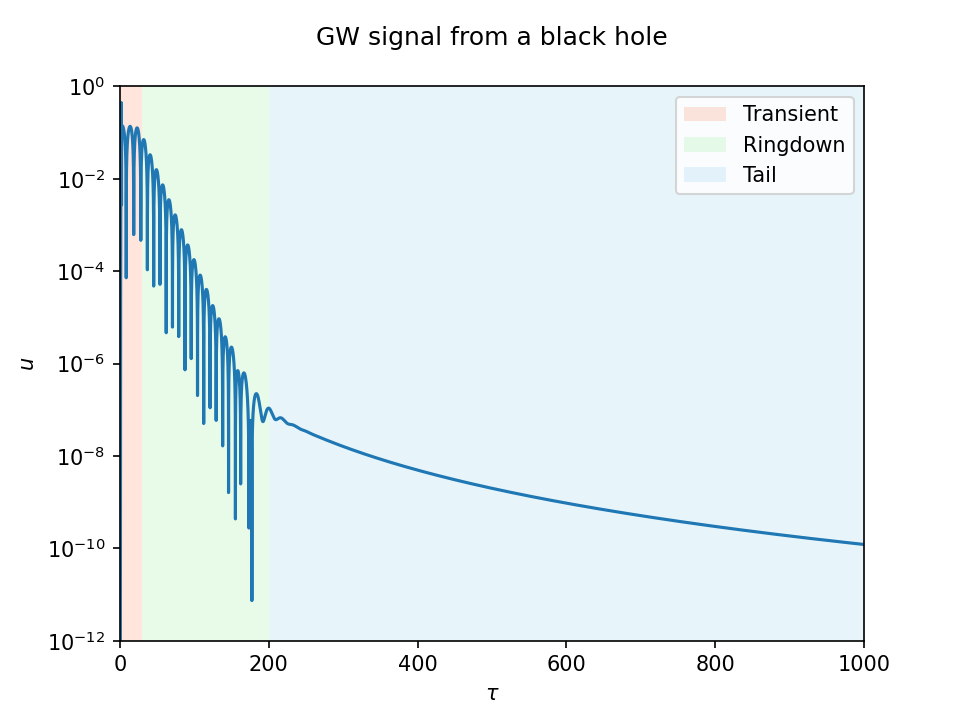
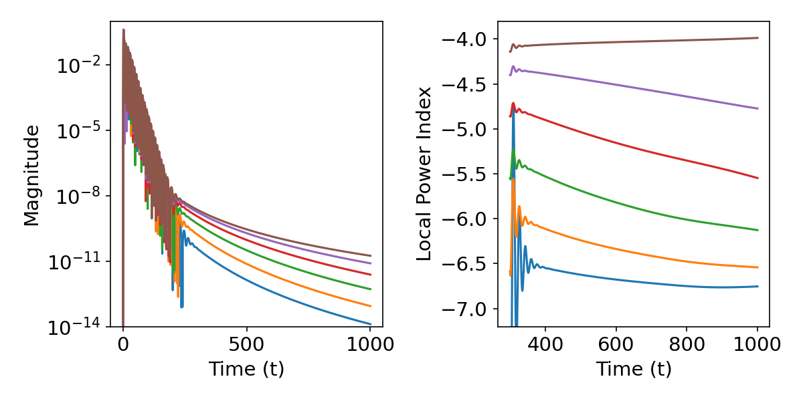

Everything vibrates. Not only do atoms and general quantum systems have characteristic frequencies, but spacetime itself vibrates. Propagating vibrations of spacetime are called gravitational waves.

> You are a function of what the whole universe is doing in the same way that a wave is a function of what the whole ocean is doing.
> 
> Alan Watts

In a [previous post](../../2023/waves-on-unbounded-domains), I gave a technical guide on how to solve wave equations on unbounded domains. The example was simple: the homogeneous, one-dimensional wave equation. While that's a nice little toy problem, it's too simple. The general solution can be written down explicitly; you don't need numerics to solve it.

This post is about a more interesting problem: *gravitational waves from black holes*. This sounds cool, and it is. I'll show you that computing gravitational waves is not that different from computing simple waves[^linear]. All you need is an additional potential term. If you want to try it out, and numerically generate your own gravitational waves, you can run the code in Colab.

<a target="_blank" href="https://colab.research.google.com/drive/1ii9zyHE9MlaOW4e9K1IBGPSPQzxltO7c">
  
</a>

We will compute gravitational waves propagating in the spacetime of a black hole by solving the [Regge-Wheeler-Zerilli equation](https://en.wikipedia.org/wiki/Regge%E2%80%93Wheeler%E2%80%93Zerilli_equations) \eqref{1}. 

## Black hole
First, a little pedantry. In general relativity, a black hole is actually not a "thing." You may hear that it's a collapsed, dense star. This is how it forms but it's not the right way to think about it in classical relativity. As far as we are concerned, the black hole is a *boundary* of our domain[^outer]. When I write about gravitational waves from a black hole, I don't mean that the black hole is waving. What's waving is the spacetime *around* the black hole. Avoid thinking of the black hole as "an object in space." Instead, think of it as a *boundary* of your domain.

A black hole is rigorously defined as the region of spacetime from which no signal can escape to the outside universe where we are. The “surface” of a black hole, called the event horizon, marks the boundary of that region. The black hole’s interior is no longer in causal contact with the external universe. It is literally not part of the manifold in which external physics takes place[^pedantry].

A black hole is not a hole in the usual sense[^hole], and it's not even black[^black].

> **Rockbiter:** Near my home, there used to be a beautiful lake. But then… then it… it was gone.  
> **Teeny Weeny:** Did the lake dry up?  
> **Rockbiter:** No. It just wasn’t there anymore. Nothing was there anymore. Not even a dried up lake.  
> **Teeny Weeny:** A hole?  
> **Rockbiter:** A hole would be something. No, it was… nothing.
>  
> — *[The NeverEnding Story](https://youtu.be/QQyorpxZ8rs?si=Cn7omN6UV6oQuPGf&t=109)* (1984)

The simplest black hole solution to Einstein's equations was discovered, amidst heavy [artillery fire](https://www.smithsonianmag.com/blogs/smithsonian-books/2025/03/13/the-man-who-helped-predict-black-holes-both-real-and-hypothetical/) and freezing conditions, a few months after Einstein published his equations for gravity. The [Schwarzschild solution](https://en.wikipedia.org/wiki/Schwarzschild_metric) (in Droste coordinates) is given by the metric
$$ ds^2 = - f(r) dt^2 + \frac{1}{f(r)} dr^2 + r^2 d\sigma^2, $$
where $d\sigma^2 = d\theta^2 + \sin^2\theta \ d\phi^2$ is the metric on the unit sphere and 
$$ f(r) = 1-\frac{2M}{r}, $$
with $M$ the mass of the black hole in natural units ($G=c=1$). Note how the function $f(r)$ vanishes at $r=2M$ leading to an apparently singular metric. This is the magic sphere (in Eddington's words) that caused a lot of confusion in the early days of relativity. We now know that this singularity is an artefact of a bad choice of time. Our regular idea of time relies on the possibility of two-way synchronization. Such a construction is not possible at the event horizon because signals sent for synchronization inevitably vanish. We'll fix this later; let's first tickle this monster and see how it laughs.

## Banging
We now perturb this spacetime[^bang] by adding a small scalar, electromagnetic, or gravitational field. Scalar fields are simplest to demonstrate the basic features of wave propagation in black hole spacetimes. Below is a simulation that I made a few years ago that shows what happens to such a scalar field when you bang the spacetime at a point some distance away from the black hole horizon[^green].


<br>

We won't perform a three-dimensional simulation, yet. To simplify the coding, we take advantage of the spherical symmetry of the black hole and decompose the scalar perturbation in [spherical harmonics](https://en.wikipedia.org/wiki/Spherical_harmonics): 
$$ U(t, r,\theta,\phi)=\sum_{\ell=0}^{\infty} \sum_{m=-\ell}^{\ell} u_{\ell m}(t,r) Y_{\ell m}(\theta,\phi). $$ 
Each mode, $u_{\ell m}$, satisfies a one-dimensional equation that looks like this:
$$ \left(\partial_t^2 - \partial_{r_\ast}^2 + V_\ell(r_\ast) \right) u_{\ell m}(t, r_\ast) = S_{\ell m}(t,r_\ast). \tag{1}\label{1}$$
The coordinate $r_\ast$ is called the *tortoise coordinate* and is defined by
$$ dr_\ast = \frac{dr}{f}, \quad \text{or} \quad \partial_{r_\ast} = f \partial_r.$$
Its domain is unbounded in both directions with $r_\ast\in(-\infty,\infty)$. A significant portion of research in black-hole perturbation theory consists in solving an equation of the type \eqref{1} for various potentials $V_\ell$ and sources $S_{\ell m}$. We'll assume no sources for this post and omit the mode-dependence in the notation. In general, you can think of the perturbations sourced by particles representing, say, a stellar black hole orbiting in the spacetime of a galactic, supermassive black hole ([extreme-mass-ratio inspiral](https://en.wikipedia.org/wiki/Extreme_mass_ratio_inspiral)). Yes, you can indeed model crazy things with a simple equation like that.

You can simply discretize and solve the equation \eqref{1} as it stands but where's the fun in that[^truncation]. Let's solve it on the full black-hole spacetime using hyperboloidal compactification. The general structure of the equation \eqref{1} is the same as the one-dimensional wave equation discussed [previously](../../2023/waves-on-unbounded-domains/). The main difference is the potential term that can represent different types of perturbations. In this post, we want to calculate gravitational waves, so we use the *gravitational* potential[^pot] given as a function of the areal coordinate $r$ as:
$$ V_{\ell}(r) = \frac{f(r)}{r^2} \left( \ell(\ell+1) - \frac{6M}{r} \right), \tag{2} \label{2} $$
where $\ell$ is the angular momentum number in the spherical harmonic decomposition. Note that the potential is given by the areal coordinate $r$ but the wave equation is written in the tortoise coordinate $r_\ast$. We'll fix this problem in a little bit. Let's first handle the unbounded domain in the tortoise coordinate $r_\ast$.

### Hyperboloidal compactification
To solve \eqref{1} on the infinite spacetime, we apply hyperboloidal compactification described in the [previous post](../../2023/waves-on-unbounded-domains). The spatial compactification and the time transformation are
$$ \rho = \rho(r_\ast), \qquad \tau = t + h(r_\ast), $$
We define
$$ H_\ast(\rho):= \frac{dh}{dr_\ast}, \qquad G_\ast(\rho):= \frac{d\rho}{dr_\ast} = \left(\frac{d r_\ast}{d\rho}\right)^{-1}. $$
We write the wave equation \eqref{1} in symmetric hyperbolic form by defining auxiliary variables as before
$$ \psi := \partial_\rho u, \qquad \pi := \frac{1-H_\ast^2}{G_\ast} \partial_\tau u - H_\ast \partial_\rho u. $$
The coupled part of the wave equation \eqref{1} is
$$ 
\begin{aligned}
\partial_\tau u
  &= \frac{G_\ast}{1-H_\ast^2}\bigl(H_\ast \psi + \pi\bigr),\\\\\[6pt\]
\partial_\tau \psi
  &= \partial_\rho \left[\frac{G_\ast}{1-H_\ast^2}\bigl(H_\ast\psi + \pi\bigr)\right],\\\\\[6pt\]
\partial_\tau \pi
  &= \partial_\rho \left[\frac{G_\ast}{1-H_\ast^2}\bigl(\psi + H_\ast \pi\bigr)\right]
   {\color{red}+ \frac{V_\ell}{G_\ast} u}.
\end{aligned}
\tag{3}\label{3}
$$
The only difference to the flat wave equation is the potential term in red. Since this is the main difference to the flat wave equation that allows us to compute gravitational waves from a black hole, let's spend some time on it.

### The gravitational potential
The relevant term of the potential in \eqref{2} for the boundaries is $\frac{f}{r^2}$. The potential vanishes linearly at the event horizon and quadratically towards infinity. But by transforming to the tortoise coordinate we modify this behavior near the horizon because the tortoise coordinate approaches exponentially as $r\to 2M$. Therefore, the potential \eqref{2}, or equivalently the term $\frac{f}{r^2}$, falls off exponentially toward the black-hole horizon and quadratically towards infinity in $r_\ast$. Below are two plots of the potential for $\ell=2$ and $M=\frac{1}{2}$, in $r$ and in $r_\ast$. The semilog plot in $r_\ast$ clearly shows the exponential decay on the left (near the horizon) and a quadratic decay on the right (toward infinity). The red dashed line marks the peak of the potential right outside the [photon sphere](https://en.wikipedia.org/wiki/Photon_sphere) around $r_p \approx 3.3 M$.


One of the reasons people like the tortoise coordinate, aside from the resulting familiarity of the equation \eqref{1}, is that it naturally provides increased resolution in the strong field region near the horizon. You can see this clearly in the right plot where the domain $r_\ast<0$ has no sharp gradients. Let's think about this a bit in our setup. 

In the compactified equation \eqref{3}, the gravitational potential is divided by the Jacobian $G_\ast$, which measures how the compactifying coordinate $\rho$ varies with the tortoise coordinate $r_\ast$. Since the infinite interval $r_\ast\in(-\infty, \infty)$ is mapped to a finite interval in $\rho$, we need $G_\ast\to 0$ at both ends. We must be careful that $G_\ast$ does not vanish faster than the potential for the ratio to be regular. Because the potential decays only quadratically towards infinity, we cannot use the exponential compactification from the [previous post](../../2023/waves-on-unbounded-domains). In the exponential compactification, $G_\ast$ vanishes faster than $r^2$ grows and the potential term blows up. With $r_\ast = \mathrm{arctanh}(\rho)$ and $G_\ast=1-\rho^2$, and considering that asymptotically $r\sim r_\ast$, we get
$$ G_\ast\ r^2 \sim (1-\rho^2) \ \mathrm{arctanh}^2\rho \to 0 \quad \text{as} \quad \rho\to 1. $$
The vanishing of $G_\ast r^2$ at infinity spoils regularity. Instead, we need an algebraic compactification. For example, something like $r_\ast = \tan\rho$ and $G_\ast=\cos^2\rho$, gives
$$ G_\ast\ r^2 \sim \cos^2\rho \ \tan^2\rho = \sin^2\rho = 1 \quad \text{as} \quad \rho\to \frac{\pi}{2}. $$

There's a geometric reason for this restriction in compactification. As $r\to\infty$ the surface area of spheres grow quadratically. Therefore, only an algebraic compactification leads to a regular equation. When we use a compactification that's too fast, the potential blows up. When the compactification behaves algebraically, such as a trigonometric function, the limit is regular. 

Having figured this out, why do we use $r_\ast$ in the first place? I mentioned that it gives us additional resolution near the horizon, but we're compactifying. We can adjust it to get the resolution we need without going through the tortoise coordinate. Let's get rid of it and compute the potential explicitly in terms of a simpler transformation $r(\rho)$. We just need to be careful about the Jacobian:
$$ G_\ast = \frac{d\rho}{dr_\ast} = \frac{dr}{dr_\ast} \frac{d\rho}{dr} =: f G, $$
where we introduced $G:=d\rho/dr$. If we now consider $H_\ast$ also as a function of $r$ and transform directly to $\rho$, we can fully avoid the tortoise coordinate.

There are clearly many choices for the compactification. A simple one that I like is this:
$$ \frac{r}{2M} = \frac{\rho}{1-\rho} \quad \implies \quad G = \frac{(1-\rho)^2}{2M}. $$
This maps the domain $r\in(2M,\infty)$ to $\rho\in(1/2,1)$. We can numerically include the boundary points because they are regular after the time transformation. The potential term becomes
$$ \frac{V_\ell}{G_\ast} = \frac{V_\ell}{f G} = \frac{\ell(\ell+1)\rho - 3(1-\rho)}{2M \rho^3}. $$
And the plot for $\ell=2, M=1$ is below.

This is *beautiful!* Note that the compactification cancels the redshift factor $f$ from the original RWZ potential. As a consequence, the peak of the *rescaled* potential is at the horizon, and it monotonically decreases from the strong field region towards infinity. We'll have no problem solving equations with such a simple term.

### Time transformation
The final remaining ingredient for our system \eqref{3} is the boost $H_\ast$. Again, there are many choices. Arguably, the simplest choice that bridges the horizon and infinity is the [minimal gauge](https://hyperboloid.al/post/minimal-gauge/). The boost function $H_\ast$ has the remarkably simple form
$$ H_\ast = -1 + \frac{8M^2}{r^2}. $$
For a bit of an intuition, observe that $H_\ast\to -1$ as $r\to\infty$ and $H_\ast\to+1$ as $r\to 2M$. So the transformed coordinate $\tau$ behaves as $u=t-r_\ast$ towards infinity and as $v=t+r_\ast$ towards the horizon. The term that ensures the regularity of the compactified equation reads:
$$ \frac{fG}{1-H_\ast^2} =  \frac{\rho^3}{8M}.$$

### The numerical solution
Let's wrap up. The choices for the compactification and time transformation above give us the following system
\begin{equation}
\begin{aligned}
\partial_\tau u
  &= \frac{\rho^{3}}{8M}\bigl(H_\ast\psi + \pi\bigr),\\\\[4pt]
\partial_\tau \psi
  &= \partial_\rho\left[\frac{\rho^{3}}{8M}\bigl(H_\ast\psi + \pi\bigr)\right],\\\\[4pt]
\partial_\tau \pi
  &= \partial_\rho\left[\frac{\rho^{3}}{8M}\bigl(\psi + H_\ast\pi\bigr)\right]
   +\frac{\ell(\ell+1)\rho - 3(1-\rho)}{2M\rho^{3}}u,
\end{aligned}
\end{equation}
with
\begin{equation}
H_\ast
= -1+\frac{8M^2}{r(\rho)^2}
= -1 + \frac{2}{\rho^2}(1-\rho)^2
\end{equation}
The system doesn't need any boundary data by construction. We simply apply one-sided stencils at the boundaries as before. All we need now is to prescribe some initial data (typically a localized Gaussian) and run the [solver](https://colab.research.google.com/drive/1ii9zyHE9MlaOW4e9K1IBGPSPQzxltO7c). The simulation in Colab takes about 30 seconds for $1000M$. I also included a different gauge condition based on constant mean curvature foliations (CMC) that's almost 4 times faster[^CMC]. For this case, the boost function is only slightly more complicated
$$ 
H^{CMC}_\ast =  - \frac{J}{\sqrt{J^2+f r^4}}, \quad J = \frac{K r^3}{3}-C,
$$
with parameters $K$ and $C$. 

Either case, you get a gravitational wave signal that looks like this at infinity:


Why infinity? Infinity is the correct model for the wave signal because we observe gravitational waves from black holes that are hundreds of millions of light years away. That's far. Very far. Mathematically, we model such distances by infinity, which we have wisely mapped to the outer boundary of our numerical domain. We've done it for technical reasons (to avoid numerical reflections, artificial truncation, to improve efficiency, etc.) but there are physical reasons why we're interested in the data at infinity.


What you see in the signal above is a typical time evolution of a black-hole perturbation divided into three distinct phases: prompt response, exponential ringdown, and polynomial tail. This behavior has been studied for over half a century by now, yet we keep discovering new phenomena in the black-hole's response to perturbations.

The prompt response is a transient phase triggered by the specifics of the perturbation. We used to discard this part because it depends on the initial data, but in the last 5 years or so there has been more attention to this piece in order to get a handle of the complete picture (see, for example, [2601.11706](https://arxiv.org/abs/2601.11706)).

The ringdown is when the spacetime oscillates at a frequency that only depends on intrinsic properties of the black hole---in our case the mass. These characteristic modes are called quasinormal modes (QNMs). Intuitively, the energy from the perturbation absorbed by the black hole and escapes to infinity. Some of the energy that goes toward the black hole gets trapped by the photon sphere. This part becomes exponentially weaker with each cycle (see the above YouTube video) which we measure as QNM ringing. The [hyperboloidal approach to QNMs](https://www.frontiersin.org/journals/physics/articles/10.3389/fphy.2024.1497601/full) has uncovered phenomena such as the [pseudospectral instability](https://journals.aps.org/prx/abstract/10.1103/PhysRevX.11.031003) that are active areas of research.

The part that escapes to infinity scatters off of the background curvature on its way and that scattered piece decays polynomially. It's very weak, so it becomes only visible after the exponential ringdown becomes smaller than the polynomially decaying part. This part is also being studied currently, specifically the [nonlinear tails](https://journals.aps.org/prl/abstract/10.1103/2brx-xnyr). The plot on the right below shows the decay rates for observers at different distances from the black hole. For the $\ell=2$ perturbation, the infinity signal decays as $t^{-4}$ whereas the finite distance signal decays as $t^{-7}$.




## Fading out

We just banged on a spacetime with a black hole and now you can [create your own](https://www.quantamagazine.org/physicists-create-a-wormhole-using-a-quantum-computer-20221130/) gravitational waves using a digital computer. Happy waving 👋

<br>

[^CMC]: I performed the [first hyperboloidal evolution of RWZ equations](https://arxiv.org/abs/0911.2450) using a CMC foliation in 2009. These coordinates go back to the 1980s, first studied in detail by [Brill, Cavallo, and Isenberg](https://pubs.aip.org/aip/jmp/article-abstract/21/12/2789/444574/K-surfaces-in-the-Schwarzschild-space-time-and-the). It's remarkable that it took three decades for these coordinates to be applied properly to study black-hole perturbations.

[^truncation]: Aside from fun, there are technical reasons why truncation is bad. First of all, truncation implies that you don't have access to the solution *at* the horizon or *at* the observer. The horizon and observer signals must be extrapolated from the truncated solution, which can get messy. In addition, truncated boundaries typically cause artificial reflections. And somewhat surprisingly, solving the problem on the infinite hyperboloidal domain is *much faster* than solving it on a large truncated domain and waiting for the signal to propagate.

[^linear]: Strictly speaking this is only true for linear perturbations. The full problem requires solving the Einstein equations, which is much harder, both technically and conceptually. In the full problem, there's no background on which waves propagate and the spacetime itself is dynamical. In this post, we're considering a simpler model for gravitational waves that is nevertheless still a topic of active research.

[^hole]: You can cross the event horizon without even realizing it.

[^black]: Due to Hawking radiation.

[^pedantry]: For the technically oriented, here's the definition. In an asymptotically flat spacetime with a future null infinity, $\mathscr{I}^{+}$, the black hole region, $\mathcal{B}$, is the complement of the causal past of future null infinity, $\mathcal{B}:=\mathcal{M}\setminus J^{-}(\mathscr{I}^+)$. Contrast this with the domain of outer communications, $\mathcal{D}:= J^{-}(\mathscr{I}^+) \cap J^{+}(\mathscr{I}^-)$. This is the region that can influence the future and be influenced by the past. If you don't jump into a black hole, you will spend your entire life in a small subset of the domain of outer communications.

[^bang]: Again, we are not "perturbing the black hole" because there is nothing to perturb where the black hole is. We are perturbing the black-hole spacetime and asking how these spacetime perturbations propagate given that there's a boundary in the spacetime waiting to swallow some of this perturbation.

[^green]: Such local perturbations approximate a delta function, so what you're seeing in the video is the [Green function](https://en.wikipedia.org/wiki/Green%27s_function) of the wave equation in a black hole spacetime. Chad Galley and I wrote a [paper](https://arxiv.org/abs/1206.1109) on this Green function where we studied caustics that you can also see in your coffee mug.


[^pot]: There are different potentials for different types of perturbations (scalar, electromagnetic, even, odd). These types of equations are called [Regge-Wheeler-Zerilli](https://en.wikipedia.org/wiki/Regge–Wheeler–Zerilli_equations) and they have a long history in relativity. Once you know how to solve this example, you'll have a powerful tool to study other interesting perturbative problems with minor modifications. The one we discuss in \eqref{2} describes axial perturbations and is the simplest gravitational potential.

[^chars]: These expressions are called characteristic variables. Disturbances propagate along characteristics.

[^constant]: We fix a constant of integration by requiring that $r_\ast(0) = 0$. Although the constant of integration is arbitrary, this choice makes the logarithm dimensionless and simplifies the construction of a global, double-null coordinate system that covers the entire Schwarzschild spacetime.

[^branches]: The Lambert W function has multiple branches. In the exterior domain with $r>2M$ the argument of $W$ is positive, so we only use the unique positive real branch $W_0$. When solving inside the horizon, we would use the negative branch $W_{-1}$. This is sometimes necessary, for example, to construct the maximal extension of Schwarzschild spacetime, or to compute solutions in the interior of the event horizon.


[^outer]: The technical term is domain of outer communications.


<!-- To evaluate the potential, we need to understand the tortoise coordinate and compute $r(r_\ast)$.

### The tortoise coordinate
The tortoise coordinate is useful because it simplifies the expression describing how disturbances propagate. The Schwarzschild metric in the tortoise coordinate becomes
$$ ds^2 = - f(r_\ast) \left(dt^2 + dr_\ast^2\right) + r^2 d\sigma^2, $$
Note that this is independent of the form of $f(r)$. Tortoise coordinates are useful for practically all spherically symmetric spacetimes, including those that describe metrics for alternative theories. Perturbations propagate as functions of $t \pm r_\ast$ which is why equation \eqref{1} looks so familiar in this coordinate[^chars]. 

In the Schwarzschild case, we can write down the tortoise coordinate explicitly in terms of the areal coordinate[^constant]
$$ r_\ast = \int \frac{dr}{f(r)} = \int \left(1+ \frac{2M}{r-2M}\right) dr = r + 2M \log\left|\frac{r}{2M}-1\right|. $$
The exterior domain of the Schwarzschild black hole, $r\in(2M,\infty)$, is mapped to $r_\ast\in(-\infty,\infty)$. We're in luck because we already know how to deal with such unbounded domains. Though, we'll see that the three dimensional space of an asymptotically flat spacetime wants a slightly different compactification than what we used before.

We need the inverse relationship that connects the areal coordinate $r$ to the tortoise coordinate $r_\ast$ because the potential $V_\ell(r)$ is given in terms of $r$ but our grid is given in $r_\ast$. Let's restrict ourselves to the exterior domain with $r>2M$ for simplicity. First we get rid of the logarithm by exponentiation
$$ e^{\frac{r_\ast}{2M}} = e^{\frac{r}{2M}} \left(\frac{r}{2M}-1\right). $$
We can solve this using the [Lambert W function](https://en.wikipedia.org/wiki/Lambert_W_function) which solves the equation $x = e^y y$ as $y(x) = W(x)$. By comparing with the equation above, we set $y=\frac{r}{2M}-1$ and $x=e^{\frac{r_\ast}{2M}-1}$. We conclude that the inverse relationship is[^branches]
$$ \frac{r}{2M} = 1 + W\left(e^{\frac{r_\ast}{2M}-1}\right). $$
The Lambert W function is implemented in the scipy package, so we define the inverse relationship in Python as follows:
```python
from scipy.special import lambertw
def r_ast_to_r(r_ast):
    return 2*M*(1+lambertw(np.exp(r_ast/(2*M)-1)).real)
```
When the input becomes very large, which happens because we compactify space, this function becomes inaccurate. There's a trick to deal with this problem. Instead of first taking the exponential and then taking the Lambert W, we use the asymptotic expansion.
$$ W(x) \sim \ln x - \ln \ln x + \dots \quad \text{as} \quad x\to\infty. $$
For large values of $r_\ast$, we write the inverse relationship as
$$ \frac{r}{2M} \sim \frac{r_\ast}{2M} - \ln \left(\frac{r_\ast}{2M}-1\right) + \dots. $$
We can add more terms into the expansion to make it more accurate. For now, the take away is that we can compute $r$ from $r_\ast$ and they approach each other asymptotically as $r_\ast\to\infty$. -->
