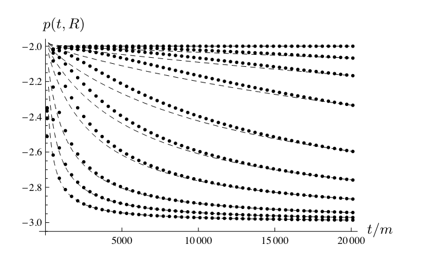

Most of my research uses infinity in numerical computations. When presenting my work, I often encounter the objection that infinity is not physical. But not all infinities are created equal, and some are more physical than others. In fact, we can **verify by experiment** that we are at infinity with respect to distant sources of radiation.

Below I collect some thoughts on infinity and describe the experiment. Feel free to skip my ramblings and go directly to the [experiment](#a-thought-experiment).

### We don't need no infinity

Physicists are generally uncomfortable with infinity. First, it is argued, infinity cannot be the outcome of a physical experiment. Second, infinity as the outcome of a calculation indicates problems with the theory. Resolving such problems is important because they may reveal new research directions such as [renormalization techniques](https://en.wikipedia.org/wiki/Renormalization). Since infinity doesn't make sense in experiment and should be avoided in theory, physicists are skeptical when it appears in mathematical descriptions of physical phenomena. A few examples: Max Tegmark argues that infinity is an idea that should be [retired from physics](https://www.edge.org/response-detail/25344); Nicolas Gisin aims to [understand time](https://www.quantamagazine.org/does-time-really-flow-new-clues-come-from-a-century-old-approach-to-math-20200407/) without relying on infinitely precise numbers; and here is a quote from [The physics of infinity](https://www.nature.com/articles/s41567-018-0238-1) by Ellis, Meissner, and Nicolai:
>We maintain that in each physical case where $\infty$ is used in a discussion, greater insight is attained by considering what large number $N$ will suffice instead because real physics is embodied in that number.

This uneasiness of physicists with infinity is also present in mathematics. There are mathematical philosophies and formalisms without infinity, such as [finitism](https://en.wikipedia.org/wiki/Finitism) or [intuitionism](https://en.wikipedia.org/wiki/Intuitionism). I was attracted to similar ideas when I was in college, so I went down the rabbit hole of [fuzzy numbers](https://en.wikipedia.org/wiki/Fuzzy_number). They seemed to "naturally" represent physical measurements, which are not real numbers with infinite precision but fuzzy numbers with uncertainties. The more I learned about fuzzy numbers, however, the less I was convinced of their general utility. They were cumbersome and did not improve calculations in most cases. I learned, by way of fuzzy numbers, that successful mathematical representations do not necessarily match our physical intuitions. The map is not the territory.

### Empirical infinity
Aristotle distinguishes [two notions of infinity](https://en.wikipedia.org/wiki/Actual_infinity): actual and potential. Potential infinity is what children learn first: numbers just keep going "forever". Actual infinity is the completion of this process: the set of all numbers as a mathematical object.

We do not observe infinity directly but we use it to represent our impressions of the natural world. In a painting, both sides of a road may meet at a [vanishing point](https://en.wikipedia.org/wiki/Vanishing_point). The road ends somewhere but the painting suggests that the meeting point is beyond the horizon of perception. The representation of "far" on the canvas is infinity. 

The infinity on the canvas is neither potential (it's a finite, completed representation of infinity) nor actual (the horizon is actually at a finite distance). Call it empirical infinity. Empirical concepts are abstracted from individual perceptions. Empirical infinity is the best canvas representation of your perception looking down a long, seemingly unending road. You don't know how far you can see, and you don't care about representing that particular detail in your painting. You just want to express that it's very far.

### A thought experiment

Black hole perturbations have a property that is different at infinity and at a finite distance. We can use this property to determine where we are with respect to the black hole. We would need very accurate detectors to measure it, which we don't have yet, so consider this a reasonable thought experiment.

Perturbations of a black hole go through an oscillatory period, and subsequently decay with a power-law $ \sim t^p$, where $t$ is time as measured by the observer and $p$ is the negative power[^2]. Surprisingly, the power $p$ is different depending on where you observe the perturbations: -3 at finite distances, -2 at infinity[^1]. The slower decay at infinity is somewhat unexpected. One could argue that the power-law decay, which was first discovered for finite distances, should be non-radiative; it shouldn't even be detected at infinity. As demonstrated by Gundlach, Price, and Pullin in 1994, it is not only radiative but decays slower at infinity than at finite distances[^3]. There are explanations of this slower decay in terms of accumulation of backscattering off of curvature towards infinity, but this is not our main concern[^4]. Given that the rates at finite distances and infinity are different, we ask the following question:

*Which decay rate would we observe?*

We are clearly a finite distance away from the black hole, so the intuitive answer is that we would measure the finite distance rate. However, the correct answer is the infinity rate.

Below is a figure from a [paper of mine]() where I studied various decay rates. The figure shows the evolution of the decay rate in time for various distances to the black hole.

The long-time decay rate is -3 for any finite distance as the theory demonstrates. But the theory is valid for the asymptotic limit. Initially, the decay rate for distant observers is much closer to -2 than to -3. The top curve in the figure is the measurement at infinity, and the next closest curve is at 40,000 units of black hole mass (in these units, a solar mass corresponds to a distance of 1.5 km). For a small black hole of 5 solar masses, this observer is about 300,000 km away. This may sound far, but it's just one light second, which is about the distance between the Earth and the Moon. To compare, typical sources of gravitational waves are thousands and millions of light years away. The decay rate of perturbations from such a distant source would be indistinguishable from the infinity value. 

Infinity in astrophysics may be closer than the Moon.

### Wrap-up

If we ever get to measure the power-law decay from black-hole perturbations, we will measure the infinity value and not the finite distance value, even though we are a finite distance away from the sources. Given that the distances are literally astronomical, it's more practical to use infinity both in our calculations and in our discussions where it's needed, instead of artificially avoiding it.

I think most people agree that actual infinity doesn't exist in the real world. But the number 3 also doesn't exist in the real world. Numbers are useful concepts abstracted from observations and represented in mathematical models. The decay rate experiment demonstrates that infinity is a useful concept in describing astrophysical observations. We should embrace empirical infinity and its appearance in our formalisms as long as it improves our calculations.

<!--  -->

[^1]: The observation of a radiative field at infinity gives the part of the field that falls off as $1/r$. In other words, for a radiative field $\phi$, its observation at infinity is $\lim_{r\to\infty} r \phi$.
[^2]: This was first discussed in detail by Richard Price in his 1972 paper [Nonspherical Perturbations of Relativistic Gravitational Collapse. I. Scalar and Gravitational Perturbations](https://journals.aps.org/prd/abstract/10.1103/PhysRevD.5.2419). The decay rate depends on initial data and mode of perturbation.
[^3]: C. Gundlach, R. H. Price, and J. Pullin. [Late-time behavior of stellar collapse and explosions. I. Linearized perturbations.](https://journals.aps.org/prd/abstract/10.1103/PhysRevD.49.883) Physical Review D 49.2, 883 (1994).
[^4]: For those of you who are wondering about the mathematical form of such a function, here is an example:
$$ \phi(t,r) \sim \frac{C_1}{(C_2+t+r)(C_3+t-r)^2} $$
The constants $C_i$ are arbitrary values determined by the initial perturbation. For fixed $r$ we have $\phi\sim 1/t^3$. Along null directions with constant $t+r$, the function decays as $\phi\sim 1/(t-r)^2$. Therefore, an observer measures the decay rate $3$ or $2$ depending on location. 