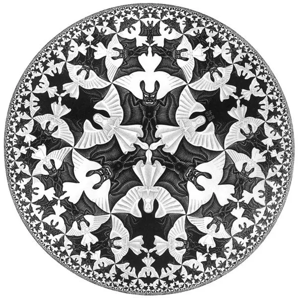

The remarkable success of the hyperboloidal approach in representing propagating fields in the exterior of isolated systems suggests that it may be a useful tool for the study of quantum fields. In this project, I explore this idea. 

In a certain sense, I argue that a choice of time provides a natural representation of physical fields. The geometry of space is hyperbolic. We live in one of Escher's drawings representing hyperbolic space.

This is clearly nonsensical heresy. Covariance under diffeomorphisms is a fundamental principle of general relativity. What does it mean that a certain choice of time is natural?

Here is the argument. The time evolution of certain physical observables does depend on foliation. For example, the ADM mass computed on Euclidean slices is constant under time evolution. The Bondi mass computed on hyperboloidal and null slices, however, decays due to radiation of energy to infinity. The Bondi mass is a more natural observable than the ADM mass. 

Consider a far away observer of a quantum system. In the mathematical idealization of this scenario, such an observer sits on future null infinity and "looks down" the null cone to observe the quantum system. The spacelike surface that this observer constructs as a surface of simultaneity will necessarily be hyperboloidal. Therefore, it seems reasonable to describe quantum fields on hyperboloidal surfaces.

In such a scenario, the idea that quantum fields are a bunch of harmonic oscillators goes away. Instead, we have damped oscillators with a complex term. Waves are stretched out towards infinity. The spatial wavelength of a quantum wave in this description is not constant, but becomes unbounded as the field extends to the observer.

### The holographic principle

The spatial geometry of the Minkowski metric in hyperboloidal coordinates matches _exactly_ the spatial geometry of the Anti-de Sitter metric in standard coordinates. I wrote about this observation two years ago in a [blog post](/post/hyperboloidal-holography/). Back then, I thought this was a known curiosity, but there seem to be other advantages of this approach to holography. I'm now exploring this idea with the help of the NSF award. It's more speculative than my usual work, but it's been fun to venture into this unfamiliar territory.
